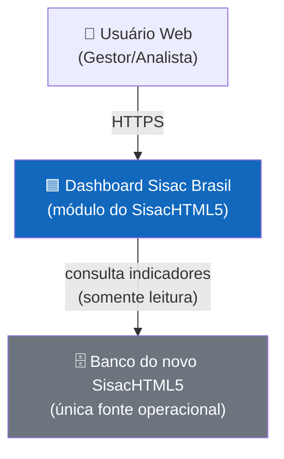
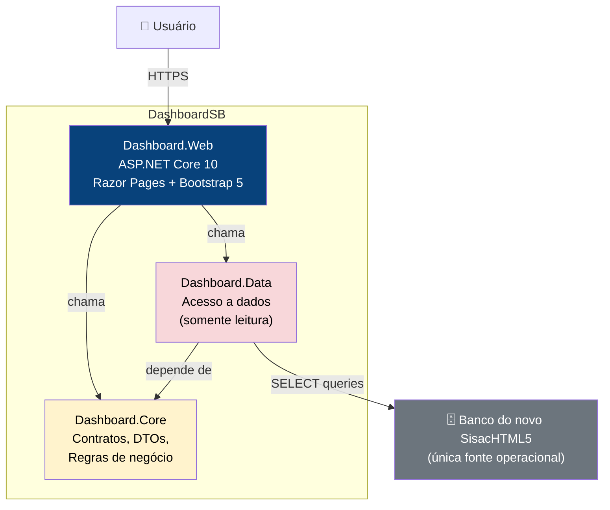
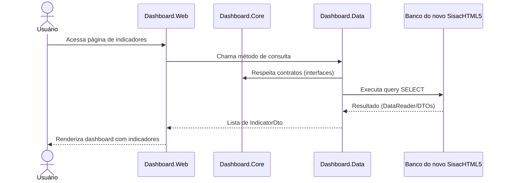

# Proposta Arquitetural — Dashboard Sisac Brasil

> Cliente: interno Leanwork · Documento gerado em 16/09/2026 · Versão 0.2 (revisada pela gate de negócio)

> **Nota de revisão (2026-09-16 — gate de negócio):** o Dashboard passou a ser módulo do novo **SisacHTML5** e a **única fonte operacional** de dados é o **banco do próprio novo SisacHTML5** (ADR-008). O sistema legado VCL/Delphi e seu banco **não são consultados em runtime** — permanecem apenas como **fonte de conhecimento, engenharia reversa e referência histórica**. ADR-003 e ADR-004 tiveram o alvo/contexto revisados; ADR-006 foi parcialmente supersedida por ADR-008. ADR-001, ADR-005 e ADR-007 permanecem válidas.

## 1. Sumário executivo

Construímos um dashboard web para visualização de indicadores do novo **SisacHTML5**, acessando dados diretamente no **banco do SisacHTML5** (única fonte operacional) por consulta somente leitura. A arquitetura em três camadas (Web → Core → Data) com Razor Pages e ASP.NET Core prioriza simplicidade operacional, manutenibilidade e segurança no acesso a dados — sem persistir indicadores, sem camada de aplicação, sem CQRS. O escopo é o **MVP de 6 indicadores** (Atendimentos, Consultas, Exames, Faturamento, Produção Médica, Despesas); Repasses permanece em roadmap. O principal risco é o **contrato de dados do novo banco ainda em definição**, mitigado por uma camada de dados com mapeamento explícito, consultas parametrizadas e bloqueio da Fase 3 até o contrato ser validado.

---

## 2. Contexto e objetivos de negócio

### 2.1 Problema

O novo **SisacHTML5** concentrará os dados operacionais do negócio, substituindo o sistema legado VCL/Delphi. Sem uma interface analítica única, gestores seguem dependendo de relatórios manuais e ferramentas externas, tornando o acompanhamento de indicadores lento e sujeito a erros. Não existe uma interface web centralizada para consulta de métricas em tempo real com dados atualizados do próprio SisacHTML5.

### 2.2 Objetivos de negócio

- Consolidar os indicadores do novo SisacHTML5 em uma interface web única e acessível
- Permitir consulta dinâmica de métricas sem necessidade de exportação manual
- Manter o escopo do MVP em **6 indicadores implementáveis**, com Repasses em roadmap (RN-40)
- Demonstrar ao diretor a capacidade analítica do novo SisacHTML5 (homologação com histórico 2025+)

### 2.3 Não-objetivos

- Não consultar o sistema legado VCL/Delphi ou seu banco em runtime (ADR-008)
- Não criar uma camada de aplicação ou backend genérico
- Não implementar persistência de indicadores (cache, snapshot, histórico)
- Não implementar CQRS, Event Sourcing ou padrões de alta complexidade
- Não criar migrations ou alterar o schema do banco do SisacHTML5
- Não implementar no MVP: Repasses, Ocupação, Glosas, Convênios independente, Unidade como dimensão (RN-40, RN-45)

### 2.4 Usuários e cargas esperadas

- Perfis: gestores e analistas que consultam indicadores periodicamente
- Volumes: ordem de dezenas a baixas centenas de usuários simultâneos
- Padrão de uso: consulta predominantemente leitura, picos em horários de reunião/reporting

---

## 3. Atributos de qualidade prioritários

### 3.1 Manutenibilidade

- **Meta concreta**: separação clara de responsabilidades entre camadas; qualquer desenvolvedor do time consegue localizar onde está a lógica de negócio, onde está o acesso a dados e onde está a apresentação
- **Por quê é prioritário**: time pequeno com múltiplos contribuidores;Change requests frequentes para novos indicadores
- **Como a arquitetura atende**: three-layer architecture com Dashboard.Core (regras, contratos, DTOs), Dashboard.Data (acesso a dados), Dashboard.Web (apresentação). Core sem dependências externas garante que regras de negócio não vazam para camadas de infraestrutura

### 3.2 Performance

- **Meta concreta**: tempo de resposta perceptivelmente baixo para carregamento de dashboards (< 2s para telas com múltiplos indicadores)
- **Por quê é prioritário**: indicadores consultados frequentemente; lentidão degrada confiança na ferramenta
- **Como a arquitetura atende**: consultas diretas ao SQL Server com mapeamento leve; sem ORM pesado; sem camada intermediária desnecessária entre dados e apresentação

### 3.3 Segurança

- **Meta concreta**: acesso ao banco do SisacHTML5 em modo exclusivo leitura; nenhuma operação de escrita acidental
- **Por quê é prioritário**: o banco do SisacHTML5 é a fonte operacional única; escrita acidental pode corromper dados de produção
- **Como a arquitetura atende**: Dashboard.Data expõe apenas operações de leitura (SELECT); conexão com string de readonly; deny de qualquer comando de escrita na camada de dados

### 3.4 Disponibilidade

- **Meta concreta**: dashboard acessível durante horário comercial; degradação graciosa se o banco do SisacHTML5 estiver indisponível
- **Por quê é prioritário**: gestores dependem dos indicadores para decisões operacionais
- **Como a arquitetura atende**: tratamento de erros na camada de dados com mensagens amigáveis (CA-10); tratamento controlado de consultas históricas pesadas (RN-43); sem dependências externas além do banco do SisacHTML5

---

## 4. Restrições

| Categoria | Restrição | Origem |
|---|---|---|
| Stack | Backend em C# / ASP.NET Core 10.0 | Decisão do projeto |
| Frontend | Razor Pages com Bootstrap 5 (renderização server-side) — a reavaliar no contexto do SisacHTML5 | Decisão do projeto (ADR-002) |
| Banco | Banco do novo **SisacHTML5** — **única fonte operacional**, acesso somente leitura | Decisão de negócio (gate 2026-09-16; ADR-008) |
| Legado | Sistema VCL/Delphi e seu banco **não são consultados em runtime** — uso apenas como conhecimento/referência histórica | Restrição de negócio (ADR-008) |
| Arquitetura | Sem Application Layer, sem CQRS/Mediator | Decisão de simplificação (ADR-001) |
| Dados | Sem persistência de indicadores — consultas dinâmicas | Decisão de design (ADR-004) |
| Core | Dashboard.Core sem dependências externas | Restrição arquitetural (ADR-005) |
| Escopo | MVP = 6 indicadores (Atendimentos, Consultas, Exames, Faturamento, Produção Médica, Despesas); Repasses/Unidade fora do MVP | Decisão de negócio (gate 2026-09-16; RN-40, RN-45) |
| Infra | Local (dotnet CLI) — sem cloud no estágio atual | Contexto do projeto |

---

## 5. Decisões arquiteturais (ADRs resumidos)

> **Nota:** após a gate de negócio (2026-09-16), **ADR-003** e **ADR-004** tiveram o alvo/contexto revisados (o banco consultado passa a ser o do novo SisacHTML5) e **ADR-006** foi **parcialmente supersedida** por **ADR-008** (que elimina o acesso ao legado). **ADR-001, ADR-005 e ADR-007 permanecem válidas**. Os ADRs completos ficam em `docs/architecture/adrs/`.

### ADR-001: Adotar arquitetura em três camadas (Web → Core → Data)

- **Contexto**: O projeto precisa de separação clara entre apresentação, regras de negócio e acesso a dados. Time pequeno; simplicidade operacional é prioridade.
- **Decisão**: Adotar três camadas com dependências unidirecionais: Dashboard.Web referencia Dashboard.Core e Dashboard.Data; Dashboard.Data referencia Dashboard.Core; Dashboard.Core não referencia ninguém.
- **Justificativa**: Atende o atributo de qualidade "Manutenibilidade" — cada camada tem responsabilidade exclusiva e pode ser testada independentemente. Evita a complexidade de Clean Architecture ou onion sem sacrificar a separação de responsabilidades.
- **Alternativas consideradas**:
  - Clean Architecture / Onion — descartada porque adiciona camadas de use cases e portas/adapters sem benefício proporcional para um sistema de consulta simples
  - Sem camadas (tudo no Web) — descartada porque viola separação de responsabilidades e dificulta testes unitários
- **Consequências**:
  - Positivas: responsabilidades claras, testabilidade, manutenibilidade
  - Negativas / dívidas plantadas: camada Data pode virar "dumping ground" de queries se não houver disciplina

### ADR-002: Usar Razor Pages como tecnologia de apresentação

- **Contexto**: Dashboard web com predominantly server-side rendering. Time familiar com ASP.NET Core. Sem necessidade de SPA interativa complexa.
- **Decisão**: Usar Razor Pages com Bootstrap 5 para toda a apresentação.
- **Justificativa**: Razor Pages é o padrão do ASP.NET Core para aplicações server-side com page-based routing. Combina com a stack .NET 10, é simples de manter, eBootstrap 5 fornece componentes responsivos sem necessidade de framework CSS customizado.
- **Alternativas consideradas**:
  - Blazor Server — descartada porque adiciona SignalR e estado de conexão; complexidade desnecessária para dashboards de consulta
  - SPA (React/Vue) + API — descartada porque dobra a complexidade de deploy e comunicação; sem necessidade de interatividade avançada
  - MVC Controller-based — descartada porque Razor Pages é mais enxuto para cenários page-based
- **Consequências**:
  - Positivas: simplicidade, deploy único, familiaridade do time
  - Negativas / dívidas plantadas: se surgir necessidade de interatividade avançada (drag-and-drop, real-time updates), Razor Pages pode não ser ideal

### ADR-003: Acesso ao banco do SisacHTML5 em modo exclusivo leitura *(alvo revisado por ADR-008)*

- **Contexto**: O banco do novo SisacHTML5 é a única fonte operacional de dados do Dashboard (ADR-008). Qualquer escrita acidental pode corromper dados de produção. O Dashboard é um módulo somente leitura.
- **Decisão**: Dashboard.Data usa connection string com permissão de leitura apenas. Todas as queries são SELECT. Nenhuma operação de INSERT, UPDATE, DELETE ou DDL é permitida na camada de dados.
- **Justificativa**: Atende o atributo de qualidade "Segurança" e o escopo de somente leitura do novo SisacHTML5.
- **Alternativas consideradas**:
  - Banco de dados dedicado com réplica — descartada porque adiciona complexidade de infraestrutura sem benefício proporcional para o volume atual
  - Views materializadas — descartada porque o schema está em definição e as views do novo modelo serão definidas pelo produto
- **Consequências**:
  - Positivas: proteção contra escrita acidental, sem overhead de réplica
  - Negativas / dívidas plantadas: dependência do contrato de dados do novo banco; mudanças no modelo podem exigir ajuste de queries (isoladas na camada Data)

### ADR-004: Não persistir indicadores — consultas dinâmicas ao banco *(contexto revisado por ADR-008)*

- **Contexto**: Indicadores precisam estar sempre atualizados a partir do banco operacional do SisacHTML5. Persistir snapshots criaria complexidade de invalidação e risco de dados desatualizados.
- **Decisão**: Todas as consultas de indicadores são executadas diretamente no banco do SisacHTML5 a cada requisição. Sem cache persistido, sem snapshots, sem tabelas de histórico.
- **Justificativa**: A complexidade de manter cache invalidado (quando o banco operacional muda) supera o benefício de performance para o volume de usuários previsto. Consultas diretas garantem dados sempre atualizados.
- **Alternativas consideradas**:
  - Cache em memória (IMemoryCache) — considerada como otimização futura se performance inadequada; não adotada como arquitetura base
  - Tabelas de snapshot — descartada porque exigiria mecanismo de invalidação e sincronização, adicionando complexidade desnecessária
  - CQRS com read models — descartada porque o sistema é predominantemente leitura, mas não justifica a complexidade de dois modelos separados
- **Consequências**:
  - Positivas: dados sempre atualizados, sem complexidade de cache, sem storage adicional
  - Negativas / dívidas plantadas: performance limitada pela latência do banco; consultas históricas pesadas (2025+) exigem tratamento controlado de lentidão (RN-43); se surgir necessidade de agregações pesadas, pode ser necessário adicionar cache

### ADR-005: Dashboard.Core sem dependências externas

- **Contexto**: A camada de_Core contém contratos (interfaces), DTOs e regras de negócio. Acoplamento externo aqui compromete a testabilidade e portabilidade.
- **Decisão**: Dashboard.Core não referencia nenhum projeto externo ou NuGet package. Todas as dependências de infraestrutura (acesso a dados, HTTP, etc.) são invertidas por interfaces definidas em Core.
- **Justificativa**: Garante que regras de negócio e contratos sejam independentes de tecnologia. Facilita testes unitários e substituição de implementações.
- **Alternativas consideradas**:
  - Referenciar Entity Framework abstratamente — descartaria porque EF é uma dependência pesada; interfaces simples (IRepository, IQuery) são suficientes
- **Consequências**:
  - Positivas: testabilidade, portabilidade, separação clara
  - Negativas / dívidas plantadas: mais interfaces para manter; pode parecer "over-engineering" para sistemas simples

### ADR-006: Tratar sistema legado como referência de conhecimento *(parcialmente supersedida por ADR-008)*

- **Contexto**: O sistema VCL/Delphi será substituído pelo novo SisacHTML5. Seu código e banco servem para entender conceitos e regras históricos — mas **não** são fonte de runtime do Dashboard (ADR-008).
- **Decisão (vigente)**: O legado é consultado apenas como **fonte de conhecimento, engenharia reversa e referência histórica** durante a construção (dicionário de dados). **O Dashboard não acessa o banco legado em runtime** (decidido por ADR-008). Nenhuma dependência técnica com o legado.
- **Justificativa**: O novo SisacHTML5 é a única fonte operacional (ADR-008). O legado não será mais consultado quando o novo sistema estiver em produção.
- **Alternativas consideradas (históricas)**:
  - API REST sobre o legado — descartada porque o legado não expõe APIs e a fonte é o novo banco
  - File export/import — descartada porque é frágil e não permite consulta em tempo real
  - Consultar o banco legado em runtime — descartada (ADR-008): o banco legado será desativado
- **Consequências**:
  - Positivas: isolamento total do legado, independência do Dashboard em relação a schema descontinuado
  - Negativas / dívidas plantadas: o conhecimento do legado precisa ser traduzido para o modelo do novo banco (contrato de dados — T-03/PLAN-001); paridade histórica com relatórios do legado não é garantida

### ADR-007: Regras de negócio dos indicadores em Dashboard.Core

- **Contexto**: As definições dos indicadores (estados, fórmulas, coberturas, períodos) não podem vazar para a camada de dados nem para a apresentação.
- **Decisão**: As **regras de negócio** dos indicadores pertencem ao **Dashboard.Core**. O Dashboard.Data executa filtros, joins, agregações e otimizações SQL técnicas; o Dashboard.Web apenas apresenta.
- **Justificativa**: Regras em Core são testáveis, reutilizáveis e independentes da tecnologia (ADR-005).
- **Consequências**: Regras novas (ex.: Repasses quando sair do roadmap) são criadas explicitamente em Core — nunca presumidas.

### ADR-008: Banco do novo SisacHTML5 como única fonte operacional do Dashboard

- **Contexto**: O Dashboard faz parte do novo SisacHTML5. Quando em operação, o banco legado não estará em funcionamento. Decisões anteriores (ADR-003/006) previam consulta ao legado em runtime.
- **Decisão**: O banco do novo **SisacHTML5** é a **única fonte operacional** do Dashboard. O legado nunca é consultado em runtime (apenas conhecimento/referência histórica). Histórico de 2025+ no banco novo usado para homologação/demonstração.
- **Justificativa**: Independência total do legado; contrato de dados definido pelo novo modelo; sem risco de consultar schema descontinuado.
- **Consequências**: queries dependem do schema do novo banco (contrato — T-03); paridade histórica não garantida; ADR-006 parcialmente supersedida.

---

## 6. Visão arquitetural

> **Níveis utilizados**: Context (1) + Container (2). Nível 3 (Component) omitido porque o sistema tem 3 containers internos simples e cada um é direto. A complexidade não justifica zoom.

### 6.1 Contexto (C4 — Nível 1)

O Dashboard Sisac Brasil é uma aplicação web que consulta dados do novo SisacHTML5 diretamente no banco do próprio SisacHTML5 (ADR-008). O sistema legado VCL/Delphi não participa do runtime — é apenas referência de conhecimento durante a construção. O usuário acessa via navegador e visualiza indicadores em tempo real.

### 6.2 Containers (C4 — Nível 2)

**Dashboard.Web** — Camada de apresentação. Razor Pages renderiza HTML no servidor com Bootstrap 5. Recebe requisições HTTP, chama a camada de dados e renderiza indicadores. Também é responsável pela escolha de formas de visualização (linhas/colunas/pizza — RN-27). Não contém regras de negócio nem acesso direto a banco.

**Dashboard.Core** — Camada de núcleo. Contém interfaces (IIndicatorRepository, etc.), DTOs (IndicatorDto, etc.) e **regras de negócio** (estados, coberturas, períodos, fórmulas — ADR-007). Sem dependências externas — é a âncora de estabilidade do sistema.

**Dashboard.Data** — Camada de dados. Implementa as interfaces definidas em Core usando ADO.NET ou Dapper para executar queries SELECT no banco do SisacHTML5 (filtros, joins, agregações). Conexão com string de leitura apenas. Não contém regras de negócio.

**Banco do novo SisacHTML5** — Fonte operacional exclusiva do Dashboard. O Dashboard se adapta ao contrato de dados definido pelo novo modelo (T-03/PLAN-001).

---

## 7. Fluxos críticos

### 7.1 Consulta de indicador do dashboard

O fluxo é direto: sem camada intermediária, sem cache persistido, sem serialização/deserialização complexa. A query vai direto ao banco e o resultado é mapeado para DTOs leves que alimentam as Razor Pages.

---

## 8. Trade-offs assumidos

- **Performance × Simplicidade**: priorizamos simplicidade. Consultas diretas ao banco do SisacHTML5 sem cache são mais lentas que cache em memória, mas eliminam a complexidade de invalidação. Consultas históricas pesadas (2025+) recebem tratamento controlado informando o usuário (RN-43). Se performance inadequada, IMemoryCache pode ser adicionado como otimização pontual.
- **Segurança × Flexibilidade**: priorizamos segurança. Acesso somente leitura ao banco protege contra escrita acidental, mas impossibilita que o dashboard escreva dados (ex: marcar indicador como "revisado"). Essa funcionalidade deve ser implementada pelo SisacHTML5, não pelo Dashboard (módulo somente leitura).
- **Manutenibilidade × Complexidade arquitetural**: priorizamos manutenibilidade. A separação em três camadas com Core sem dependências adiciona mais arquivos e interfaces, mas garante que regras de negócio não vazam para camadas de infraestrutura e facilita testes.

---

## 9. Dívidas técnicas conscientes

- **Dívida 1: Sem cache de indicadores**
  - **Quando vira problema**: quando o tempo de resposta das queries ultrapassar 2-3 segundos percebidos pelo usuário, ou quando múltiplos usuários simultâneos sobrecarregarem o SQL Server
  - **Como pagar**: adicionar IMemoryCache com TTL curto (30-60s) nos repositories; invalidação por tempo é suficiente para dados que mudam pouco

- **Dívida 2: Contrato de dados dependente do modelo do novo SisacHTML5**
  - **Quando vira problema**: quando o modelo do SisacHTML5 alterar nomes de tabelas, colunas ou tipos de dados, ou enquanto o contrato de dados não estiver validado (T-03)
  - **Como pagar**: manter queries parametrizadas e isoladas na camada Data; quando o contrato mudar, atualizar apenas a camada Data sem afetar Core nem Web. O contrato é validado na Fase 1 (T-03) antes de qualquer query (PLAN-001).

- **Dívida 3: Sem testes automatizados no estágio atual**
  - **Quando vira problema**: quando surgirem múltiplos indicadores com regras de cálculo complexas que precisam ser validadas
  - **Como pagar**: criar projetos de teste (xUnit) para Dashboard.Core (regras de negócio) e Dashboard.Data (queries)

---

## 10. Riscos e mitigações

| Risco | Impacto | Probabilidade | Mitigação |
|---|---|---|---|
| Contrato de dados do novo banco ainda em definição ou muda sem aviso | Alto | Média | Contrato validado na Fase 1 (T-03) antes de query alguma; queries isoladas na camada Data; testes de integração que validam a estrutura esperada |
| Performance inadequada para consultas históricas pesadas (2025+) | Médio | Média | Tratamento controlado de lentidão informando o usuário (RN-43); otimização SQL na camada Data; IMemoryCache como otimização pontual se necessário |
| Permissão de leitura no banco do SisacHTML5 negada ou revogada | Alto | Baixa | Documentar requisitos de permissão; teste de conexão no startup; degradação graciosa (CA-10) |
| Definições de negócio pendentes (faturamento, produção, despesas) | Médio | Alta | Alinhamento com stakeholders e produto na Fase 1 (T-02); regras em Core (ADR-007); nothing presumido — legado é evidência, não contrato (ADR-008) |

---

## 11. Próximos passos

1. Fechar as definições de negócio do MVP (Fase 1 — T-02: faturamento, produção, despesas, coberturas, períodos)
2. Estabelecer e validar o contrato de dados do banco do SisacHTML5 para os seis indicadores (Fase 1 — T-03)
3. Criar projetos Dashboard.Core e Dashboard.Data no Dashboard.slnx (T-04)
4. Definir contratos (interfaces) em Dashboard.Core para acesso a dados (T-07)
5. Implementar queries dos indicadores em Dashboard.Data, conforme o contrato validado (T-08 a T-13)
6. Criar interface dos indicadores, gráficos e filtros (T-14 a T-18)
7. Rodar `/leanwork-context` para atualizar AGENTS.md com a nova stack
8. Decidir sobre necessidade de testes automatizados (xUnit) (T-19/T-20)

---

## 12. Apêndice — Aspectos não cobertos

- Detalhes de UI/UX → design system / Figma (quando existir)
- Segurança aplicacional (autenticação, autorização) → documento separado (fora do escopo atual)
- Detalhes de deployment e CI/CD → configurar conforme necessidade
- Cronograma e estimativa → backlog/planejamento de sprint
- Integração com outros sistemas além do banco do SisacHTML5 → não prevista no escopo atual
- Repasses (roadmap), Unidade como dimensão, Ocupação, Glosas, Convênios independente → fora do MVP (backlog)
