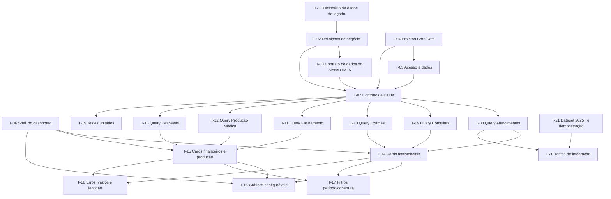

# Plano de Execução: Dashboard de Indicadores

**PRD de referência:** `docs/prds/PRD-001-dashboard-indicadores.md`
**Cliente/Produto:** Dashboard Sisac Brasil (módulo do novo SisacHTML5)
**Stack:** C# / ASP.NET Core 10.0, Razor Pages, Bootstrap 5, banco do novo SisacHTML5 (somente leitura)
**Autor:** Agente IA (leanwork-start)
**Data:** 2026-09-16
**Status:** Rascunho — revisão 2 (T-02 fechado documentalmente em 2026-09-17; revisão 1: gate de negócio aprovada em 2026-09-16)

> **Nota de revisão (gate de negócio 2026-09-16):**
> - **Fonte única de dados:** banco do novo **SisacHTML5** (ADR-008). O legado VCL/Delphi não é consultado em runtime e não é contrato de dados.
> - **Escopo MVP:** seis indicadores implementáveis — **Atendimentos, Consultas, Exames, Faturamento, Produção Médica, Despesas**.
> - **Fora do MVP:** Repasses (bloqueado — regra a definir), Ocupação, Glosas, Convênios como indicador independente, Unidade como dimensão/filtro.
> - **Fase 1** manteve T-01 (concluída — conhecimento do legado) e T-02 (em andamento). **T-03 foi redefinida**: não é mais "capacidade do SQL Server legado"; agora é o **contrato de dados do novo banco** para os indicadores.
> - As tarefas antigas de Ocupação/Glosas/Convênios foram **eliminadas** (indicadores fora do MVP). Quadro de correspondência na seção 12.

> **Nota de revisão (revisão 2 — fechamento documental T-02, 2026-09-17):**
> - **Premissa de banco:** o **banco SQL padrão instalado para o SisacHTML5 é essencialmente o mesmo banco utilizado pelo SghProg** (poucas mudanças/exclusões de colunas; estrutura geral no padrão do SghProg). O **SghProg permanece fonte estrutural válida de engenharia reversa** para o T-03; estruturas conhecidas **não são descartadas automaticamente**; as diferenças vs. o banco do SisacHTML5 serão confirmadas no T-03 e tratadas como **evidência de evolução do modelo**. **Regras de negócio não são copiadas do SghProg** (ADR-007/ADR-008).
> - **T-02 fechado documentalmente:** as decisões de negócio (faturamento/conta a faturar, produtividade médica, despesas, consulta/retorno, períodos) foram fornecidas pela gate humana e registradas no PRD-001 (revisão 2). A **identificação técnica** correspondente permanece para o **T-03** (a partir do banco padrão do SisacHTML5).

---

## 1. Resumo executivo

Implementação do Dashboard de Indicadores em seis fases: (1) alinhamento das definições de negócio e **contrato de dados do banco do novo SisacHTML5** — desbloqueando as questões em aberto do PRD; (2) fundação técnica (projetos, acesso a dados, shell do dashboard); (3) contratos e queries dos seis indicadores do MVP; (4) interface dos cards, gráficos e filtros; (5) qualidade (erros, vazio, lentidão, testes); (6) dataset histórico de homologação e demonstração ao diretor. O fatiamento é horizontal por camada — a barreira real de execução é o contrato de dados do novo banco (Q1), que precede qualquer query.

## 2. Estratégia de entrega

**Modelo de entrega:** incremental por fase, com comportamento demonstrável a partir da Fase 4.

**Critério geral de "pronto":** os critérios de aceite do PRD verificáveis (CA-01 a CA-20), testes unitários e de integração passando, e validação humana dos indicadores contra o histórico de 2025 e anteriores (homologação conceitual).

**Ponto crítico da estratégia:** o schema do banco do novo SisacHTML5 (única fonte — ADR-008) ainda está em definição. O plano não presume nomes de tabelas/colunas. As tarefas da Fase 1 existem para **produzir** as respostas (definições de negócio + contrato de dados); as tarefas de implementação de query (Fase 3) ficam explicitamente bloqueadas até o contrato de dados ser documentado e validado.

## 3. Premissas e decisões

> ⚠️ **Premissa:** O banco do novo SisacHTML5 é a **única fonte operacional** de dados do Dashboard (ADR-008). O legado não será consultado em runtime e suas tabelas/colunas **não** são contrato — são apenas conhecimento de engenharia reversa (documentado em T-01).
> ⚠️ **Premissa:** As entidades, colunas e definições de negócio dos indicadores serão confirmadas a partir do modelo do novo SisacHTML5 (T-03). Nenhuma query é escrita com schema presumido.
> ⚠️ **Premissa (T-02 — 2026-09-17):** o banco SQL padrão do SisacHTML5 é **essencialmente o mesmo banco do SghProg** (pequenas mudanças/exclusões de colunas). Sob essa premissa, o **SghProg permanece fonte estrutural válida de engenharia reversa** e suas estruturas conhecidas **não são descartadas automaticamente** — as diferenças serão confirmadas no T-03 e tratadas como **evidência de evolução do modelo**. **Regras de negócio não são copiadas do SghProg** (ADR-007/ADR-008); o T-03 parte da estrutura conhecida do SghProg para **confirmar o que permanece** no banco do SisacHTML5.
> ⚠️ **Premissa (gate de negócio):** MVP implementa **6 indicadores**. **Repasses está no escopo conceitual/roadmap e é bloqueado** — sem tarefa de implementação, sem fórmula assumida (RN-40). Unidade é evolução futura (RN-45). SUS é considerado somente quando o serviço atender SUS (RN-26).
> ⚠️ **Premissa:** O histórico de **2025 e anteriores** estará disponível no banco novo e será usado para **homologação e demonstração** (RN-44).
> ⚠️ **Premissa:** A autenticação está fora do escopo desta entrega (Q9 — fora do escopo atual) — não bloqueia nenhuma tarefa do plano.
> ⚠️ **Premissa:** O padrão de testes do projeto será decidido na Fase 5; para a stack .NET o candidato natural é xUnit, mas a decisão pertence ao executor com validação humana.

Decisões técnicas relevantes já tomadas (referência ADR):

- **Decisão:** Arquitetura em três camadas (Web → Core → Data) com dependências unidirecionais — *referência: ADR-001*
- **Decisão:** Razor Pages com Bootstrap 5 para apresentação — *referência: ADR-002 (a reavaliar no contexto do SisacHTML5)*
- **Decisão:** Acesso ao banco do novo SisacHTML5 exclusivamente leitura — *referência: ADR-003 (alvo revisado por ADR-008)*
- **Decisão:** Sem persistência de indicadores — consultas dinâmicas — *referência: ADR-004*
- **Decisão:** Dashboard.Core sem dependências externas — *referência: ADR-005*
- **Decisão:** Banco do novo SisacHTML5 como única fonte operacional do Dashboard — *referência: ADR-008*
- **Decisão:** Regras de negócio dos indicadores pertencem ao Dashboard.Core — *referência: ADR-007*

## 4. Mapa de dependências

## 5. Fases

### Fase 1 — Alinhamento de negócio e contrato de dados

**Objetivo da fase:** Responder às questões em aberto do PRD: fechar as definições de negócio (faturamento, produção, despesas, coberturas, períodos) e o **contrato de dados** que o banco do novo SisacHTML5 deve expor para os seis indicadores do MVP. O legado entra apenas como conhecimento de referência (T-01, já concluído).

**Critério de conclusão da fase:** As questões em aberto do MVP estão respondidas, o contrato de dados está documentado e validado pelo produto, e as Fases 3+ podem abrir sem presumir schema.

---

#### T-01 — Documentar o conhecimento do sistema legado por indicador (dicionário de dados)

- **Status:** Concluído
- **Decisão de arquitetura associada:** ADR-008 *(legado = referência de conhecimento, não contrato)* — a tarefa documenta conhecimento, não um contrato a ser seguido
- **Complexidade:** Alta
- **Depende de:** nenhuma
- **Implementa:** —
- **Valida:** —
- **Decisões base:** ADR-006, ADR-008
- **Camadas/arquivos afetados:**
  - `docs/architecture/dicionario-de-dados.md` *(novo — output da tarefa)*
  - Acesso ao SQL Server legado via SQL Management Studio ou query de catálogo (somente leitura, para engenharia reversa)

**Descrição:**
Investigar o schema do banco legado e documentar, para os domínios de negócio dos indicadores, quais tabelas e colunas representam cada conceito na solução antiga. Serve como **fonte de conhecimento e engenharia reversa** para apoiar o modelo do novo banco — **não** é contrato de dados do Dashboard (ADR-008). O output está em `dicionario-de-dados.md` (anexo §13 — definições T-02 já confirmadas para a semântica dos estados).

**Critério de aceite (testável):**
- [x] Dicionário de dados documentado (tabelas, colunas, relacionamentos, estados) para os domínios dos indicadores
- [x] Definições de negócio confirmadas registradas (anexo §13)
- [ ] Revisão humana concluída pelo time que opera o legado (validação do dicionário como fonte de conhecimento)

**Testes a escrever:**
- *Não aplicável* — tarefa de investigação e documentação.

**Riscos / pontos de atenção:**
- É documentação de conhecimento; decisões de modelagem do novo banco pertencem ao produto (SisacHTML5), não ao Dashboard
- O gate de negócio autorizou T-01 como referência histórica apenas — nenhuma query futura consultará o legado

---

#### T-02 — Alinhar definições de negócio dos indicadores do MVP com stakeholders

- **Status:** Concluído (fechamento documental em 2026-09-17)
- **Complexidade:** Média
- **Depende de:** T-01
- **Implementa:** —
- **Valida:** — *(suporta RN-04, RN-26, RN-28..RN-33, RN-34..RN-36, RN-37..RN-39, RN-42)*
- **Decisões base:** ADR-007
- **Camadas/arquivos afetados:**
  - `docs/architecture/dicionario-de-dados.md` *(editado — anexo com definições confirmadas)*
  - `docs/prds/PRD-001-dashboard-indicadores.md` *(editado — revisão 2: decisões de negócio incorporadas)*

**Descrição:**
Sessão de alinhamento com o produto (SisacHTML5) e stakeholders para fechar as definições de negócio do MVP:
- **Faturamento (Q4):** **conta a faturar** = contas de pacientes de convênio com alta e faturamento incompleto, permanecendo em movimento próprio até o faturamento completo; fluxo conceitual Atendimento → Alta → Conta em processo → Envio/auditoria → Faturamento completo (RN-31, RN-33)
- **Produção Médica (Q3):** produtividade = produção do profissional no período, comparável entre profissionais, não presumida como apenas consultas (RN-16); unidade técnica em T-03
- **Despesas (Q5):** composição de fixas/variáveis registrada (RN-37/RN-38); repasse médico conforme natureza contratual; origem e data de referência em T-03
- **Coberturas (Q10):** SUS somente quando o serviço atende SUS (RN-26); identificação técnica de Particular/Convênio/SUS em T-03
- **Período (Q6):** atual = período calendário corrente; futuros consultáveis; sem dados futuros = estado informativo, não previsão (RN-04, RN-42)

> **Nota de fechamento (2026-09-17):** a gate humana forneceu as decisões de negócio (faturamento/conta a faturar, produtividade, despesas, consulta × retorno, períodos). As **definições de negócio foram incorporadas** ao PRD-001 (revisão 2) e ao dicionário de dados (anexo T-02). A **identificação técnica** correspondente (entidades físicas, estados, campos, origem das despesas etc.) fica **dependente do T-03**. Nenhuma regra foi inventada nem copiada do SghProg — apenas premissas estruturais confirmadas (banco SisacHTML5 ≈ SghProg; ver ADR-008).

**Critério de aceite (testável):**
- [x] Definições de Faturamento (conta a faturar, fluxo, comparação) registradas (valida RN-31..RN-33)
- [x] Definição de Produtividade e natureza da produção registrada (valida RN-16, RN-34..RN-36)
- [x] Composição das Despesas (grupos/categorias/referência) registrada (valida RN-37..RN-39)
- [x] Modelo de coberturas (Particular/Convênio/SUS) confirmado no nível de negócio (valida RN-26)
- [x] Regras do filtro por período confirmadas (valida RN-04, RN-42)
- [x] Ajustes às RNs, se houver, aprovados pelo responsável do PRD *(aprovados na gate humana — fechamento documental T-02)*

> **Observação de fechamento:** a **identificação técnica** desses critérios (nomes físicos, estados, campos, origem das despesas) **permanece pendente do T-03** — não é reintroduzida aqui.

**Testes a escrever:**
- *Não aplicável* — tarefa de alinhamento de negócio.

**Riscos / pontos de atenção:**
- As respostas dependem do produto (novo SisacHTML5) — podem atrasar a Fase 3
- Qualquer alteração de regra deve ser aprovada pelo responsável do PRD antes de virar tarefa
- **Ponto de validação humana obrigatório:** cada definição confirmada precisa de aprovação explícita do stakeholder correspondente

---

#### T-03 — Estabelecer o contrato de dados do banco do novo SisacHTML5 para os indicadores

- **Status:** Concluído (2026-09-17) — investigação documental + complemento de validação no banco operacional; a **regra de "Despesa Provisionada"** permanece como evidência/pendência (**E/P**) para a etapa apropriada, sem bloquear a fundação estrutural
- **Complexidade:** Alta
- **Depende de:** T-02
- **Implementa:** —
- **Valida:** — *(suporta todas as queries da Fase 3)*
- **Decisões base:** ADR-008 *(única fonte operacional = banco do SisacHTML5)*
- **Camadas/arquivos afetados:**
  - `docs/architecture/contrato-dados-dashboard.md` *(criado — contrato físico com classificação D/E/P; complemento 2026-09-17 concluiu o domínio Despesas)*
  - `docs/architecture/dicionario-de-dados.md` *(editado — domínios conceituais e contrato de dados)*
  - `docs/architecture/adrs/` *(possível ADR avulso se houver decisão de interface/performance)*

**Descrição:**
Identificar e validar com o produto (SisacHTML5) o **contrato de dados** mínimo que o banco do novo SisacHTML5 expõe para os seis indicadores do MVP: entidades, atributos, estados e relacionamentos (Atendimento/Consulta/Exame, Guia/Conta/Faturamento, Profissional/Produção, Despesas, Coberturas). Registrar como **domínios conceituais** no dicionário (§14), sem nomes físicos presumidos como contrato.

> **Orientações do fechamento T-02 (2026-09-17):** o **banco SQL padrão do SisacHTML5 é essencialmente o mesmo banco do SghProg** (poucas mudanças/exclusões de colunas — ADR-008). Portanto o **T-03 parte da estrutura conhecida do SghProg** (dicionário de dados, T-01) como **referência estrutural** e valida, no banco operacional do SisacHTML5, **quais estruturas realmente permanecem**; diferenças/exclusões são **evidência de evolução do modelo** e devem ser registradas. **Regras de negócio não são copiadas do SghProg** — as regras já definidas (PRD-001 revisão 2) prevalecem.

É deste contrato que derivam as queries da Fase 3 (filtros, joins e agregações em Core/Data — ADR-007).

> **Progresso T-03 (2026-09-17):** investigação documental concluída. Criado `docs/architecture/contrato-dados-dashboard.md` com a matriz do contrato (estruturas, campos, tipos, relacionamentos, evidência, status), mapa de datas e de relacionamentos, riscos de performance e **37 pendências** (P1–P37). **Nenhum item pôde ser marcado como D (confirmado no SisacHTML5)** — sem acesso ao banco operacional, os itens ficam como **E** (evidência SghProg/CASAMATER) ou **P** (pendente). **Despesas:** nenhuma estrutura de origem identificada no legado — investigação necessária no SisacHTML5 (módulo contábil/integração). Bloqueios: acesso de leitura ao banco do SisacHTML5, validação com o time e definição da origem das despesas.

> **Complemento T-03 (2026-09-17 — fechamento):** validação direta no banco operacional acessível pelo Dashboard (`DESENVHMSISAC02\MSSQLSERVER2022`, banco `CASAMATER`, usuário `dashboard_readonly`, somente leitura). O domínio **Despesas** foi **confirmado (D)** nas tabelas **`dbo.PAGAR`** (títulos/parcelas — principal) e **`dbo.PAGARC`** (complementar/fiscal): sem FK declarada; chaves lógicas **K4** = `CODFORNECEDOR+NFISCAL+FILIAL+GRUPOEMP` e **K5** = K4+`NPARC`; cardinalidade **1:N**; **risco de dupla contagem** (por K4, 168.735/170.062 NFs com `PAGARC.VALOR` = Σ `PAGAR.VALOR` — não somar as duas tabelas); PAGARC apresentou `DATAPAG` NULL em todos os registros analisados, e PAGAR concentra os dados de parcela/pagamento/saldo. **Regra de "Despesa Provisionada" NÃO inventada**: `DATAPREV` = **E** (100% dos 10.087 PAGAR não pagos preenchida); semântica formal e regra de inclusão/exclusão de cancelamentos/estornos = **P** (novas pendências P38–P40 no contrato). Nenhum dado/objeto/permissão do banco alterado. T-04 permanece validado/concluído.

**Critério de aceite (testável):**
- [x] Contrato de dados registrado para os indicadores (entidades, atributos mínimos, estados, relacionamentos) — como **evidência E / pendência P** em `contrato-dados-dashboard.md`
- [x] Contrato validado com confirmação no **banco operacional do SisacHTML5** (promover E→D) — **parcial**: domínio **Despesas** promovido a **D** (complemento 2026-09-17); demais domínios permanecem E/P até validação específica
- [ ] Valores de cobertura (Particular/Convênio/SUS) e estados de faturamento confirmados no SisacHTML5
- [x] Estruturas do SghProg confirmadas/excluídas no banco do SisacHTML5 registradas como evidência de evolução do modelo — **parcial**: `PAGAR`/`PAGARC` confirmadas (Despesas); demais estruturas pendentes
- [x] Nome físico/schema adotado como contrato somente com confirmação — `PAGAR`/`PAGARC` confirmados no banco (D); **regra de negócio de "Despesa Provisionada" não inventada** (E/P — P38–P40)
- [ ] Contrato validado pelo produto (SisacHTML5)

**Testes a escrever:**
- *Não aplicável* — definição de contrato.

**Riscos / pontos de atenção:**
- **Bloco estrutural:** sem contrato validado, a Fase 3 não abre
- O modelo do SisacHTML5 ainda está em definição — alinhar cedo com o time do produto para não bloquear o MVP

---

### Fase 2 — Fundação técnica

**Objetivo da fase:** Criar a base estrutural do projeto que independe das decisões de schema: projetos, referências, acesso a dados e shell do dashboard.

**Critério de conclusão da fase:** Solução compila com Dashboard.Core e Dashboard.Data, acesso a dados configurado com leitura apenas, e o shell do dashboard renderiza a página inicial.

---

#### T-04 — Criar projetos Dashboard.Core e Dashboard.Data e referências de projeto

- **Status:** Concluído (2026-09-17) — gate de fundação autorizada; critérios de aceite satisfeitos
- **Complexidade:** Baixa
- **Depende de:** nenhuma
- **Implementa:** —
- **Valida:** —
- **Decisões base:** ADR-001 *(três camadas)*
- **Camadas/arquivos afetados:**
  - `Dashboard.slnx` *(editado — adiciona projetos)*
  - `Dashboard.Core/Dashboard.Core.csproj` *(novo)*
  - `Dashboard.Data/Dashboard.Data.csproj` *(novo)*
  - `Dashboard.Web/Dashboard.Web.csproj` *(editado — referências)*

**Descrição:**
Criar os projetos de biblioteca de classes `Dashboard.Core` e `Dashboard.Data` (net10.0, Nullable enable, ImplicitUsings enable), adicioná-los ao `Dashboard.slnx`, e configurar as referências: `Dashboard.Web → Dashboard.Core`, `Dashboard.Web → Dashboard.Data`, `Dashboard.Data → Dashboard.Core`. `Dashboard.Core` **sem PackageReference** (ADR-005). Projetos ficam vazios — apenas estrutura. *Autorização: gate de fundação aprovada (2026-09-17).*

> **Registro de execução (2026-09-17):**
> - **Criados:** `Dashboard.Core` e `Dashboard.Data` (Class Library, net10.0, Nullable enable, ImplicitUsings enable; `Class1.cs` do template removido — projetos vazios).
> - **Solução:** `Dashboard.Core` e `Dashboard.Data` adicionados ao `Dashboard.slnx`.
> - **Referências adicionadas:** `Dashboard.Web → Dashboard.Core`, `Dashboard.Web → Dashboard.Data`, `Dashboard.Data → Dashboard.Core`.
> - **Sem dependências externas:** Core sem `PackageReference` e sem referência a projetos; Data sem `PackageReference` (nenhum pacote instalado).
> - **Build:** `dotnet build Dashboard.slnx` — **0 avisos, 0 erros**.
> - **Dashboard.Web:** apenas o `.csproj` alterado (referências); `Program.cs`, Pages, appsettings e demais funcionalidades intactos.

**Critério de aceite (testável):**
- [x] `dotnet build Dashboard.slnx` compila sem erros
- [x] Referências de projeto seguem ADR-001 (Core não referencia ninguém)
- [x] `Dashboard.Core.csproj` não contém PackageReference

**Testes a escrever:**
- *Não aplicável* — tarefa estrutural.

**Riscos / pontos de atenção:**
- Manter o `Dashboard.Web` intacto — apenas adicionar referências, não alterar comportamento

---

#### T-05 — Configurar acesso a dados somente leitura no banco do SisacHTML5

- **Status:** Concluído (2026-09-17) — validado: teste de integração real (`SELECT 1`) executado com sucesso (1 teste, 0 falhas); credencial fornecida por variável de ambiente, nunca gravada
- **Complexidade:** Média
- **Depende de:** T-04
- **Implementa:** —
- **Valida:** —
- **Decisões base:** ADR-003 *(somente leitura — alvo revisado por ADR-008)*; ADR-005 *(Core sem dependências)*; stack Dapper + Microsoft.Data.SqlClient documentada em `t03-acesso-sql-readonly.md`
- **Camadas/arquivos afetados:**
  - `Dashboard.Data/*` *(nova pasta de conexão/factory)*
  - `Dashboard.Web/Program.cs` *(editado — DI)*
  - `Dashboard.Web/appsettings.json` / `appsettings.Development.json` *(config)*
  - `Dashboard.Data.Tests/*` *(novo — teste de integração)*
  - `.gitignore` *(editado — exclui appsettings locais)*

**Descrição:**
Implementar fábrica de conexão (`IDbConnection`) para o banco do novo SisacHTML5 com connection string de **leitura apenas** (permissão mínima). Registrar o serviço no DI em `Program.cs`. A connection string vem de configuração de ambiente — **nunca** gravada em repositório. Materializa o gate de segurança ADR-003/ADR-008.

> **Registro de execução (2026-09-17):**
> - **Pacotes instalados (somente em `Dashboard.Data`, conforme ADR-005):** `Microsoft.Data.SqlClient` 7.0.3 + `Dapper` 2.1.86 (stack definida em `t03-acesso-sql-readonly.md`). `Dashboard.Core` permanece **sem** PackageReference.
> - **Criada fábrica de conexão:** `Dashboard.Data/Connections/ISqlConnectionFactory` (abstração `IDbConnection`) + `SqlConnectionFactory` (abre `SqlConnection` com a connection string fornecida; **sem nenhum método de escrita**).
> - **DI em `Dashboard.Web/Program.cs`:** registrado `ISqlConnectionFactory` como singleton usando `builder.Configuration.GetConnectionString("SisacDatabase")`.
> - **Config:** `appsettings.json` contém apenas **placeholder vazio** `ConnectionStrings:SisacDatabase` (sem servidor/usuário/senha). Credencial real via **User Secrets (dev)** ou **variável de ambiente** — nada versionado.
> - **`.gitignore`:** adicionado `appsettings.*.local.json` — credentials locais fora do Git.
> - **Build:** `dotnet build Dashboard.slnx` — **0 avisos, 0 erros**.
> - **Teste de integração criado:** `Dashboard.Data.Tests/Connections/SqlConnectionFactoryTests.factory_abre_conexao_com_banco_sisac_html5` (lê credencial de `ConnectionStrings__SisacDatabase`; não inventa resultado).
> - **Lacuna registrada:** credencial de leitura (`dashboard_readonly`) **não estava disponível no ambiente de execução** (senha não interativa/no repo). `dotnet test` reporta o teste como **FAIL com mensagem de lacuna** — resultado real depende da credencial. **Nenhum resultado inventado.**
> - **Validação real (2026-09-17 — encerramento):** com a credencial fornecida por **variável de ambiente** (`ConnectionStrings__SisacDatabase`), o teste de integração foi executado com sucesso — **1 teste, 0 falhas**, conexão SQL validada com `SELECT 1`. **Nenhuma senha/segredo gravado em arquivo ou commit.**

**Critério de aceite (testável):**
- [x] Factory abre conexão com o banco do novo SisacHTML5 usando credencial de leitura — validado (teste de integração real, 0 falhas)
- [x] Query de teste `SELECT 1` executa com sucesso — validado (credencial via variável de ambiente)
- [x] Connection string não aparece em arquivos commitados — placeholder vazio + User Secrets/env + `.gitignore`
- [x] Nenhum método exposto permite escrita (INSERT/UPDATE/DELETE) — apenas `Create()` (abre `SqlConnection`)

**Testes a escrever:**
- *Integration:* `factory_abre_conexao_com_banco_sisac_html5` (requer credencial de leitura disponível) — **escrito em `Dashboard.Data.Tests`**

**Riscos / pontos de atenção:**
- Pode depender de credencial de leitura fornecida pelo time de infra/produto — alinhar antes
- Se a credencial não estiver disponível, registrar a lacuna e avisar antes de prosseguir — **registrado em 2026-09-17**

---

#### T-06 — Criar shell do dashboard (layout, navegação, página inicial)

- **Status:** Concluído (2026-09-17) — critérios de aceite evidenciados (build / execução / renderização HTTP); validação visual humana no navegador recomendada
- **Complexidade:** Baixa
- **Depende de:** nenhuma
- **Implementa:** —
- **Valida:** — *(CA-01 parcial — a página renderiza, mas sem indicadores até a Fase 4)*
- **Decisões base:** ADR-002 *(Razor Pages + Bootstrap 5)*
- **Camadas/arquivos afetados:**
  - `Dashboard.Web/Pages/Shared/_Layout.cshtml` *(editado — Bootstrap 5, navegação preservada)*
  - `Dashboard.Web/Pages/Index.cshtml` *(editado — título, seção e seis placeholders)*
  - `Dashboard.Web/Pages/Index.cshtml.cs` *(não alterado — desnecessário nesta tarefa)*

**Descrição:**
Ajustar o layout Razor Pages com Bootstrap 5 (via CDN ou libman), criar a estrutura da página inicial com a área dos seis indicadores do MVP (placeholder cards), e manter a navegação padrão. Os valores dos indicadores entram na Fase 4.

> **Decisão Bootstrap 5 (2026-09-17):** usado o **bundle local já presente** em `wwwroot/lib/bootstrap` (**v5.3.3**, carregado por `~/lib/bootstrap/dist/css/bootstrap.min.css` e `bootstrap.bundle.min.js`). **Não foi usado CDN** — sem dependência de internet na execução e sem novas dependências/pacotes. Rasgo (`.gitignore`) e restante da estrutura preservados.

> **Registro de execução (2026-09-17):**
> - **`_Layout.cshtml`:** `lang` → `pt-BR`; título da aplicação → "Dashboard de Indicadores"; navbar Bootstrap 5 (`navbar-expand-lg`, `data-bs-theme="light"`), **navegação padrão preservada** (Home / Privacy); footer com o nome do dashboard.
> - **`Index.cshtml`:** título "Dashboard de Indicadores", subtítulo explicando que os valores virão na Fase 4 e badge "Aguardando implementação dos dados"; **exatamente seis** placeholders (`Atendimentos`, `Consultas`, `Exames`, `Faturamento`, `Produção Médica`, `Despesas`) em `row row-cols-1 row-cols-sm-2 row-cols-lg-3 g-4` (1 coluna no celular, 2 no tablet, 3 no desktop).
> - **Placeholders:** cada card traz o nome do indicador e a área visual com o texto **"Aguardando dados"** — **nenhum número fictício** e **nenhum valor de indicador**.
> - **Sem dados/acesso:** nenhuma consulta ao banco, nenhum Repository/DTO/Service/interface de indicador/gráfico/filtro/autenticação; `Index.cshtml.cs` **não alterado**; infraestrutura de conexão da T-05 **intacta**.
> - **Build:** `dotnet build Dashboard.slnx` — **0 avisos, 0 erros**.
> - **Execução:** `Dashboard.Web.dll` (equivalente a `dotnet run`) subiu sem erro; `ASPNETCORE_URLS=http://localhost:5199`; requisição `GET /` → **HTTP 200**, `text/html`, `OnGet` executado sem exceção; **stderr vazio**.
> - **Validação de renderização (HTTP):** HTML retornado contém `<link ... bootstrap.min.css>` (Bootstrap 5.3.3 local), os **seis** títulos de indicador e **seis** ocorrências de "Aguardando dados". Bootstrap renderiza com o bundle local (sem CDN).
> - **Riscos encontrados:** nenhum bloqueante. Permanece o risco já mapeado de o SisacHTML5 adotar outro framework visual (ADR-002 a revalidar com o produto).

**Critério de aceite (testável):**
- [x] Página inicial renderiza com Bootstrap 5 carregado — Bootstrap 5.3.3 local referenciado no HTML; `GET /` = 200
- [x] Área visual com espaço reservado para os seis indicadores — seis cards "Aguardando dados" no grid responsivo
- [x] `dotnet run --project Dashboard.Web` sobe sem erro — execução 200 sem exceção; stderr vazio

**Testes a escrever:**
- *Não aplicável* — tarefa de estrutura visual. Validação manual via navegador (recomendada).

**Riscos / pontos de atenção:**
- CDN dispensado — bundle local já existente evita dependência de internet (risco eliminado)
- Contexto do novo SisacHTML5 pode usar outro framework visual — revalidar com o produto (ADR-002)

---

### Fase 3 — Contratos e queries dos indicadores

**Objetivo da fase:** Definir os contratos em Dashboard.Core e implementar as queries em Dashboard.Data para os seis indicadores do MVP, **utilizando exclusivamente o contrato de dados validado em T-03**.

**Critério de conclusão da fase:** As seis queries existem, retornam DTOs corretos, e os cálculos respeitam as RNs correspondentes com as definições confirmadas.

> ⚠️ **Bloco estrutural:** Esta fase **não pode iniciar** enquanto o contrato de dados (T-03) e as definições de negócio (T-02) não estiverem concluídos. Nenhuma query referencia tabela/coluna não documentada no contrato.

---

#### T-07 — Definir contratos e DTOs base dos indicadores em Dashboard.Core

- **Status:** Pendente
- **Complexidade:** Média
- **Depende de:** T-02, T-03, T-04
- **Implementa:** RN-42 *(filtro por período uniforme: atual/passado/futuro)*
- **Valida:** —
- **Decisões base:** ADR-001, ADR-005 *(Core sem dependências)*, ADR-007 *(regras em Core)*
- **Camadas/arquivos afetados:**
  - `Dashboard.Core/Contratos/IIndicatorRepository.cs` *(novo)*
  - `Dashboard.Core/Contratos/IIndicatorRepository[T].cs` *(novo — se genéricos)*
  - `Dashboard.Core/DTOs/IndicatorData.cs` *(novo)*
  - `Dashboard.Core/DTOs/IndicatorFilter.cs` *(novo — período + cobertura)*

**Descrição:**
Definir em Dashboard.Core (sem dependências externas) os contratos de repositório e os DTOs base compartilhados: filtro (período atual/passado/futuro com datas inicial/final — RN-04, RN-42; categoria de cobertura — RN-26) e resultado (valor, período de referência de negócio, unidade). Nenhum DTO específico de indicador é criado **até** que o contrato de T-03 confirme a forma dos dados.

**Critério de aceite (testável):**
- [ ] Contratos e DTOs base compilam sem dependências externas no projeto Core
- [ ] Filtro suporta período atual/passado/futuro e categoria de cobertura
- [ ] Resultado carrega valor + período de referência de negócio + unidade de medida
- [ ] Nenhum DTO específico inventa campo sem respaldo no contrato de T-03

**Testes a escrever:**
- *Não aplicável* — criação de contratos. Testes das implementações entram nas tarefas seguintes.

**Riscos / pontos de atenção:**
- Se T-02/T-03 atrasarem, esta tarefa fica em **Bloqueado** — não implementar DTOs com schema presumido
- Novo campo que se mostrar necessário ao implementar as queries deve ser adicionado aqui com validação

---

#### T-08 — Implementar query de Atendimentos em Dashboard.Data

- **Status:** Pendente
- **Complexidade:** Média
- **Depende de:** T-05, T-07
- **Implementa:** RN-07, RN-08, RN-09, RN-26 *(cobertura)*
- **Valida:** CA-03, CA-09, CA-18
- **Decisões base:** ADR-003, ADR-008
- **Camadas/arquivos afetados:**
  - `Dashboard.Data/Repositories/AtendimentosRepository.cs` *(novo)*
  - `Dashboard.Core/DTOs/AtendimentosDto.cs` *(novo — forma confirmada em T-03)*

**Descrição:**
Implementar a consulta de Atendimentos conforme o contrato de dados (T-03) e a definição de "tipo de atendimento" (Q2). A query conta atendimentos no período filtrado, com filtro opcional por tipo e por categoria de cobertura Particular/Convênio/SUS (RN-08, RN-26), usando a data de atendimento como referência (RN-09). **As colunas exatas vêm do contrato — nada é presumido.**

**Critério de aceite (testável):**
- [ ] Query retorna quantidade total de atendimentos no período (RN-07)
- [ ] Filtro por tipo funciona conforme definição confirmada (Q2)
- [ ] Filtro por cobertura funciona (RN-26)
- [ ] Data de referência é a data de atendimento, não a de lançamento (RN-09)
- [ ] Período sem registros retorna estado vazio (CA-09)

**Testes a escrever:**
- *Integration:* `CA_03_atendimentos_por_periodo_retorna_quantidade_correta`
- *Integration:* `CA_18_atendimentos_por_cobertura_particular_convenio_sus`
- *Integration:* `atendimentos_periodo_sem_dados_retorna_vazio_ca09`

**Riscos / pontos de atenção:**
- **Bloqueado até T-02/T-03 concluídas** — contrato de dados e modelagem Atendimento/Consulta/Exame (Q2) são pré-requisitos
- SUS só é considerado quando o serviço atender SUS (RN-26)

---

#### T-09 — Implementar query de Consultas em Dashboard.Data

- **Status:** Pendente
- **Complexidade:** Média
- **Depende de:** T-05, T-07
- **Implementa:** RN-28, RN-30 *(relação definida pelo novo modelo)*, RN-26 *(cobertura)*
- **Valida:** CA-11, CA-18
- **Decisões base:** ADR-003, ADR-008
- **Camadas/arquivos afetados:**
  - `Dashboard.Data/Repositories/ConsultasRepository.cs` *(novo)*
  - `Dashboard.Core/DTOs/ConsultasDto.cs` *(novo — forma confirmada em T-03)*

**Descrição:**
Implementar a consulta de Consultas conforme o contrato de dados (T-03). A query conta as consultas do período filtrado (primeira consulta/retorno conforme definição confirmada — RN-28), filtrada por cobertura (RN-26). A relação com Atendimento/Exame segue o modelo do novo banco (RN-30) — **não** presume hierarquia.

**Critério de aceite (testável):**
- [ ] Query retorna quantidade de consultas no período (RN-28), distinguindo primeira consulta/retorno quando definido
- [ ] Filtro por cobertura funciona (RN-26)
- [ ] Relação com Atendimento segue o contrato do novo modelo (RN-30)
- [ ] Período sem registros retorna estado vazio (CA-09)

**Testes a escrever:**
- *Integration:* `CA_11_consultas_no_periodo_retorna_quantidade`
- *Integration:* `CA_18_consultas_por_cobertura`

**Riscos / pontos de atenção:**
- **Bloqueado até T-02/T-03** — a distinção primeira consulta/retorno depende da definição do produto (RN-28)
- Confirmar com o produto se Consulta é entidade própria ou categoria de atendimento no novo modelo (RN-30)

---

#### T-10 — Implementar query de Exames em Dashboard.Data

- **Status:** Pendente
- **Complexidade:** Média
- **Depende de:** T-05, T-07
- **Implementa:** RN-29, RN-30, RN-26 *(cobertura)*
- **Valida:** CA-12, CA-18
- **Decisões base:** ADR-003, ADR-008
- **Camadas/arquivos afetados:**
  - `Dashboard.Data/Repositories/ExamesRepository.cs` *(novo)*
  - `Dashboard.Core/DTOs/ExamesDto.cs` *(novo — forma confirmada em T-03)*

**Descrição:**
Implementar a consulta de Exames conforme o contrato de dados (T-03), contando os exames do período filtrado por tipo/grupo quando aplicável (RN-29), com filtro por cobertura (RN-26) e relação definida pelo novo modelo (RN-30).

**Critério de aceite (testável):**
- [ ] Query retorna quantidade de exames no período (RN-29), por tipo/grupo quando aplicável
- [ ] Filtro por cobertura funciona (RN-26)
- [ ] Relação com Atendimento segue o contrato do novo modelo (RN-30)
- [ ] Período sem registros retorna estado vazio (CA-09)

**Testes a escrever:**
- *Integration:* `CA_12_exames_no_periodo_retorna_quantidade`
- *Integration:* `CA_18_exames_por_cobertura`

**Riscos / pontos de atenção:**
- **Bloqueado até T-02/T-03** — tipo/grupo de exame e modelagem (RN-29, RN-30) dependem do contrato
- Se o novo modelo registrar exames como itens de atendimento, o DTO refletirá essa forma (RN-30)

---

#### T-11 — Implementar query de Faturamento em Dashboard.Data

- **Status:** Pendente
- **Complexidade:** Média
- **Depende de:** T-05, T-07
- **Implementa:** RN-10, RN-11, RN-12, RN-13, RN-31, RN-32, RN-33
- **Valida:** CA-04, CA-14
- **Decisões base:** ADR-003, ADR-008, ADR-007 *(estados em Core)*
- **Camadas/arquivos afetados:**
  - `Dashboard.Data/Repositories/FaturamentoRepository.cs` *(novo)*
  - `Dashboard.Core/DTOs/FaturamentoDto.cs` *(novo — forma confirmada em T-03)*

**Descrição:**
Implementar a consulta de Faturamento conforme o contrato de dados (T-03): soma dos valores das guias/contas do período (RN-12), distinguindo **contas faturadas** e **contas a faturar** (RN-31) e permitindo comparação com o período anterior (RN-32), filtro por convênio cadastrado (RN-11), data de emissão da guia como referência (RN-13). Estados e "emissão" seguem o modelo do novo banco (RN-33) — regras em Core. **Nada presumido (inclusive os estados).**

**Critério de aceite (testável):**
- [ ] Query retorna soma dos valores faturados no período (RN-10)
- [ ] Filtro por convênio funciona (RN-11)
- [ ] Base de cálculo é guia/conta de atendimento, não recebimento (RN-12)
- [ ] Data de referência é a de emissão da guia (RN-13)
- [ ] Distingue contas faturadas e a faturar (RN-31)
- [ ] Compara período anterior × atual (RN-32)

**Testes a escrever:**
- *Integration:* `CA_04_faturamento_total_no_periodo_retorna_valor_somado`
- *Integration:* `CA_14_faturamento_distingue_faturadas_e_a_faturar_e_compara_periodos`

**Riscos / pontos de atenção:**
- **Bloqueado até T-02/T-03** — estados de faturamento (Q4) e definição de "emissão" são requisitos de T-02
- Valores monetários — conferir tipo decimal no contrato

---

#### T-12 — Implementar query de Produção Médica em Dashboard.Data

- **Status:** Pendente
- **Complexidade:** Média
- **Depende de:** T-05, T-07
- **Implementa:** RN-14, RN-16, RN-34, RN-35, RN-36, RN-26 *(cobertura)*
- **Valida:** CA-05, CA-18
- **Decisões base:** ADR-003, ADR-008
- **Camadas/arquivos afetados:**
  - `Dashboard.Data/Repositories/ProducaoMedicaRepository.cs` *(novo)*
  - `Dashboard.Core/DTOs/ProducaoMedicaDto.cs` *(novo — forma confirmada em T-03)*

**Descrição:**
Implementar a consulta de Produção Médica conforme o contrato de dados (T-03) e a métrica de produtividade formalizada em T-02: medida de produção por **profissional ativo** no período (RN-16, RN-34), análise **individual/profissional** por categoria de cobertura (RN-26, RN-35) e por categoria do serviço (RN-26, RN-36). **A definição de produtividade e de "profissional ativo" (Q3) vem de T-02 — sem ela, a tarefa não é implementável.**

**Critério de aceite (testável):**
- [ ] Query calcula a produtividade pela métrica formalizada (RN-14, RN-16, RN-34)
- [ ] Análise individual/profissional por cobertura: Particular/Convênio/SUS (RN-35)
- [ ] Análise por categoria do serviço (RN-36)
- [ ] Divisão por zero (nenhum profissional ativo) tratada — retorna 0 ou estado vazio

**Testes a escrever:**
- *Unit:* `CA_05_produtividade_por_profissional_ativo_calculada`
- *Integration:* `produtividade_por_cobertura_retorna_valores_por_categoria_ca18`
- *Integration:* `produtividade_retorna_zero_quando_sem_profissionais_ativos`

**Riscos / pontos de atenção:**
- **Bloqueado até T-02/T-03** — métrica de produtividade e "profissional ativo" (Q3) são requisitos de T-02
- Filtro por especialidade é evolução (RN-15) — não faz parte do MVP inicial

---

#### T-13 — Implementar query de Despesas em Dashboard.Data

- **Status:** Pendente
- **Complexidade:** Média
- **Depende de:** T-05, T-07
- **Implementa:** RN-37, RN-38, RN-39
- **Valida:** CA-13
- **Decisões base:** ADR-003, ADR-008
- **Camadas/arquivos afetados:**
  - `Dashboard.Data/Repositories/DespesasRepository.cs` *(novo)*
  - `Dashboard.Core/DTOs/DespesasDto.cs` *(novo — forma confirmada em T-03)*

**Descrição:**
Implementar a consulta de Despesas conforme o contrato de dados (T-03) e a composição de grupos definida em T-02 (Q5): despesas **fixas** e **variáveis** no período (RN-37, RN-38), dados estruturados para comparação gráfica (RN-39). A data de referência (competência vs. pagamento), categorias e origens seguem T-02/T-03 — regras em Core. **Não inventar composição de despesas a partir do legado.**

**Critério de aceite (testável):**
- [ ] Query retorna total de despesas fixas do período (RN-37)
- [ ] Query retorna total de despesas variáveis do período (RN-38)
- [ ] Estrutura permite comparação gráfica fixas × variáveis (RN-39)
- [ ] Grupo/categoria/referência conforme definido em T-02

**Testes a escrever:**
- *Integration:* `CA_13_despesas_fixas_e_variaveis_retornam_valores`
- *Unit:* `despesas_filtradas_por_grupo_fixa_variavel`

**Riscos / pontos de atenção:**
- **Bloqueado até T-02/T-03** — composição de despesas (Q5), data de referência e origem no novo banco são requisitos de T-02
- Nenhuma despesa inventada — apenas o que o contrato expor

---

### Fase 4 — Interface dos indicadores

**Objetivo da fase:** Exibir os seis indicadores no dashboard com cards, gráficos configuráveis, filtros e tratamento de estados vazios/erro/lentidão.

**Critério de conclusão da fase:** Dashboard renderiza os seis indicadores com dados reais, filtros funcionais, gráficos configuráveis, e mensagens adequadas para estados vazios, erro de conexão e consultas lentas.

---

#### T-14 — Implementar cards dos indicadores assistenciais (Atendimentos, Consultas, Exames)

- **Status:** Pendente
- **Complexidade:** Baixa
- **Depende de:** T-06, T-08, T-09, T-10
- **Implementa:** —
- **Valida:** CA-03, CA-11, CA-12
- **Decisões base:** ADR-002
- **Camadas/arquivos afetados:**
  - `Dashboard.Web/Pages/Index.cshtml` *(editado — cards)*
  - `Dashboard.Web/Pages/Index.cshtml.cs` *(editado — chamadas aos repositórios)*
  - `Dashboard.Web/Shared/_IndicatorCard.cshtml` *(novo — partial reutilizável)*

**Descrição:**
Criar o partial `_IndicatorCard` reutilizável e renderizar os cards de Atendimentos (RN-07, CA-03), Consultas (RN-28, CA-11) e Exames (RN-29, CA-12). Os valores vêm dos repositórios de T-08, T-09 e T-10. Incluir suporte ao período de referência e à seleção de cobertura no card.

**Critério de aceite (testável):**
- [ ] Cards dos três assistenciais exibem a quantidade do período selecionado (CA-03, CA-11, CA-12)
- [ ] Partial `_IndicatorCard` é reutilizável (título, valor, período, unidade)
- [ ] Cards exibem a categoria de cobertura selecionada (RN-26)
- [ ] Cards comportam estado vazio (CA-09) e erro (CA-10)

**Testes a escrever:**
- *Não aplicável* — visual. Cobertura de CA via T-20.

**Riscos / pontos de atenção:**
- Nenhum risco crítico — tarefa de composição visual simples

---

#### T-15 — Implementar cards financeiros e de produção (Faturamento, Despesas, Produção Médica)

- **Status:** Pendente
- **Complexidade:** Baixa
- **Depende de:** T-06, T-11, T-12, T-13
- **Implementa:** —
- **Valida:** CA-04, CA-05, CA-13, CA-14
- **Decisões base:** ADR-002
- **Camadas/arquivos afetados:**
  - `Dashboard.Web/Pages/Index.cshtml` *(editado — cards)*
  - `Dashboard.Web/Pages/Index.cshtml.cs` *(editado — chamadas aos repositórios)*

**Descrição:**
Renderizar os cards de Faturamento (valor em R$ — CA-04; distinguindo faturadas/a faturar e comparando períodos — CA-14), Produção Médica (métrica formalizada — CA-05) e Despesas (fixas/variáveis — CA-13), reutilizando o partial `_IndicatorCard` de T-14. Valores monetários formatados conforme RN-05; percentuais conforme RN-06.

**Critério de aceite (testável):**
- [ ] Card de Faturamento exibe valor formatado "R$ X.XXX,XX" e distinção faturado/a faturar (CA-04, CA-14)
- [ ] Card de Produção exibe a métrica com o formato definido (CA-05)
- [ ] Card de Despesas apresenta fixas e variáveis comparáveis (CA-13)
- [ ] Reutiliza `_IndicatorCard` sem duplicação de markup

**Testes a escrever:**
- *Não aplicável* — visual. Cobertura de CA via T-20.

**Riscos / pontos de atenção:**
- Nenhum risco crítico

---

#### T-16 — Implementar gráficos configuráveis (linhas, colunas, pizza)

- **Status:** Pendente
- **Complexidade:** Média
- **Depende de:** T-14, T-15
- **Implementa:** RN-27, RN-39
- **Valida:** CA-13, CA-16
- **Decisões base:** ADR-002, ADR-008 *(responsabilidade de apresentação = Web)*
- **Camadas/arquivos afetados:**
  - `Dashboard.Web/Pages/Index.cshtml` *(editado — componentes de gráfico)*
  - `Dashboard.Web/Pages/Index.cshtml.cs` *(editado — dados para os gráficos)*
  - `Dashboard.Web/Shared/_IndicatorChart.cshtml` *(novo — partial de gráfico)*

**Descrição:**
Implementar a renderização de gráficos para os indicadores com escolha de forma de visualização (linhas, colunas, pizza) quando semanticamente adequada (RN-27). A escolha do gráfico é responsabilidade da apresentação (Web), **não** regra de negócio. O indicador de Despesas usa a comparação gráfica fixas × variáveis (RN-39, CA-13). Framework de gráfico a definir na implementação (ex.: Chart.js/Chartist) com validação humana.

**Critério de aceite (testável):**
- [ ] Indicador pode ser exibido em mais de uma forma de visualização (CA-16)
- [ ] Curvas e agregados por período (linhas/colunas) alimentados pelos dados reais
- [ ] Despesas compara fixas × variáveis graficamente (CA-13)
- [ ] Troca de visualização não altera dados/regras (RN-27 — apenas apresentação)

**Testes a escrever:**
- *Não aplicável* — visual. Validação manual de CA-16 e cobertura via T-20.

**Riscos / pontos de atenção:**
- Confirmar framework de gráficos compatível com o shell do SisacHTML5
- Gráficos são somente apresentação (RN-27) — não podem alterar cálculo do Core

---

#### T-17 — Implementar filtros de período e categoria de cobertura

- **Status:** Pendente
- **Complexidade:** Média
- **Depende de:** T-14, T-15
- **Implementa:** RN-04, RN-26, RN-42
- **Valida:** CA-02, CA-15, CA-18
- **Decisões base:** ADR-002, ADR-008
- **Camadas/arquivos afetados:**
  - `Dashboard.Web/Pages/Index.cshtml` *(editado — seletor de período/cobertura)*
  - `Dashboard.Web/Pages/Index.cshtml.cs` *(editado — afeta todas as chamadas)*
  - `Dashboard.Core/DTOs/IndicatorFilter.cs` *(editado — validação do filtro)*

**Descrição:**
Implementar o mecanismo **uniforme** de filtro (RN-42): período **atual** (padrão: mês corrente — RN-04), **passado** e **futuro**, ambos com data inicial e data final (CA-15). Adicionar a seleção de **categoria de cobertura** (Particular/Convênio/SUS — RN-26; SUS somente quando o serviço atender SUS). Ao trocar o filtro, todos os cards/gráficos recarregam (CA-02, CA-18). A lista de convênios vem do contrato de dados (T-03) — não é inventada. **Unidade como filtro é evolução futura (RN-45) — fora do MVP.**

**Critério de aceite (testável):**
- [ ] Período padrão é o mês corrente (RN-04)
- [ ] Período passado e futuro aceitam data inicial e data final (CA-15)
- [ ] Troca de período recarrega os seis indicadores (CA-02)
- [ ] Seletor de cobertura lista Particular/Convênio/SUS conforme o contrato (RN-26)
- [ ] Cada indicador respeita sua data de referência de negócio (RN-42)
- [ ] Unidade não aparece como filtro no MVP (RN-45)

**Testes a escrever:**
- *Integration:* `CA_02_troca_de_periodo_recarrega_indicadores`
- *Unit:* `filtro_por_periodo_valida_datas_inicial_final_atual_passado_futuro`
- *Integration:* `CA_18_filtro_por_cobertura_aplica_aos_indicadores_assistenciais`

**Riscos / pontos de atenção:**
- Períodos futuros precisam de definição confirmada (T-02, Q6)
- Lista de coberturas e convênios depende do contrato de dados (T-03)

---

#### T-18 — Implementar tratamento de erro, estados vazios e consultas lentas

- **Status:** Pendente
- **Complexidade:** Média
- **Depende de:** T-14, T-15
- **Implementa:** RN-03, RN-43
- **Valida:** CA-09, CA-10, CA-17
- **Decisões base:** ADR-003, ADR-004, ADR-008
- **Camadas/arquivos afetados:**
  - `Dashboard.Web/Pages/Index.cshtml` *(editado — mensagens de estado)*
  - `Dashboard.Web/Pages/Index.cshtml.cs` *(editado — try/catch + controle de demora por indicador)*
  - `Dashboard.Data/*` *(editado — propagação de erro de conexão)*

**Descrição:**
Implementar os estados especiais: (1) período/cobertura sem dados → mensagem "Nenhum dado encontrado" em cada card (RN-03, CA-09); (2) falha de conexão com o banco do SisacHTML5 → "Dados indisponíveis no momento" com opção de retry (CA-10); (3) consulta potencialmente lenta/inviável (históricos pesados) → tratamento **controlado**: informar o usuário sobre a demora e permitir cancelar/ajustar/tentar novamente (RN-43, CA-17), evitando travamento indefinido. Cada indicador trata sua falha isoladamente — um card não derruba os demais.

**Critério de aceite (testável):**
- [ ] CA-09 verde: card sem dados exibe "Nenhum dado encontrado"
- [ ] CA-10 verde: falha de conexão exibe "Dados indisponíveis no momento" com retry
- [ ] CA-17 verde: consulta lenta informa o usuário e permite cancelar/ajustar/tentar
- [ ] Um card com erro não afeta o carregamento dos demais
- [ ] Zero real exibido como "0", não como vazio (RN-03)

**Testes a escrever:**
- *Integration:* `CA_09_indicador_sem_dados_exibe_nenhum_dado_encontrado`
- *Integration:* `CA_10_falha_de_conexao_exibe_dados_indisponiveis`
- *Integration:* `CA_17_consulta_lenta_informa_usuario_e_permite_cancelar`
- *Integration:* `erro_em_um_indicador_nao_derruba_os_demais`

**Riscos / pontos de atenção:**
- Simular falha de conexão em teste exige banco indisponível ou mock — definir a costura de injeção com cuidado
- O limite/estratégia de demora da consulta lenta é decisão de produto (documentada em RN-43) — implementar via configuração

---

### Fase 5 — Qualidade e testes

**Objetivo da fase:** Fechar a cobertura de testes dos cálculos e das queries, e garantir que os critérios de aceite do PRD estejam verificáveis de ponta a ponta.

**Critério de conclusão da fase:** CA-01 a CA-20 verificáveis; testes unitários e de integração passando.

---

#### T-19 — Escrever testes unitários dos cálculos e formatação

- **Status:** Pendente
- **Complexidade:** Baixa
- **Depende de:** T-07
- **Implementa:** —
- **Valida:** CA-05, CA-13, CA-16 *(validação unitária do cálculo e formatos)*
- **Decisões base:** ADR-005
- **Camadas/arquivos afetados:**
  - `Dashboard.Core.Tests/` *(novo projeto de teste, se aprovado)*
  - `Dashboard.Core/*` *(editado somente se necessário para testabilidade)*

**Descrição:**
Criar projeto de testes (xUnit ou conforme decisão do executor com validação humana) cobrindo os cálculos puros e formatações: produtividade (RN-16, CA-05), despesas fixas/variáveis (RN-37/38, CA-13), divisão por zero, formatação de valores (RN-05, RN-06) e regras de visualização de dados para os gráficos (RN-27). Testes nomeados `CA_XX_descricao_do_cenario` conforme convenção.

**Critério de aceite (testável):**
- [ ] Testes nomeados `CA_05_*`, `CA_13_*`, `CA_16_*` conforme convenção
- [ ] Cobertura dos cálculos e formatação
- [ ] Casos de divisão por zero cobertos
- [ ] Testes passam com `dotnet test`

**Testes a escrever:**
- *Unit:* `CA_05_produtividade_por_profissional_ativo`, `CA_13_despesas_fixas_variaveis`, `divisao_por_zero_retorna_tratamento_definido`, `formatacao_valor_monetario_reais`
- *Unit:* `CA_16_dados_de_grafico_preservam_valores_ao_trocar_visualizacao`

**Riscos / pontos de atenção:**
- Adicionar projeto de teste ao `Dashboard.slnx` — verificar com o time se é criação nova ou projeto de teste existente

---

#### T-20 — Escrever testes de integração das queries

- **Status:** Pendente
- **Complexidade:** Alta
- **Depende de:** T-08, T-09, T-10, T-11, T-12, T-13, T-21 *(dataset de homologação disponível)*
- **Implementa:** —
- **Valida:** CA-03, CA-04, CA-05, CA-11, CA-12, CA-13, CA-14, CA-15, CA-18, CA-20
- **Decisões base:** ADR-003, ADR-008
- **Camadas/arquivos afetados:**
  - `Dashboard.Data.Tests/` *(novo projeto de teste, se aprovado)*
  - `Dashboard.Data/*` *(editado somente se necessário para testabilidade)*

**Descrição:**
Criar testes de integração que executam as queries reais contra o banco do SisacHTML5 (ambiente de teste/homologação com dados conhecidos) e validam os valores retornados contra os CAs do PRD. Testes nomeados conforme convenção `CA_XX_*`. Exigem base com dados previsíveis — usar o dataset histórico de homologação (T-21) com expectativas conhecidas. Sempre verificando que as queries são SELECT (ADR-003).

**Critério de aceite (testável):**
- [ ] Um teste de integração por indicador (CA-03, CA-04, CA-05, CA-11, CA-12, CA-13, CA-14)
- [ ] Cobertura de filtros e coberturas (CA-15, CA-18) e de histórico 2025+ (CA-20)
- [ ] Queries executam contra base de teste/homologação com dados conhecidos
- [ ] Testes passam e são reproduzíveis
- [ ] Nenhuma escrita na base — validação de que queries são SELECT (ADR-003)

**Testes a escrever:**
- *Integration:* `CA_03_atendimentos_*`, `CA_04_faturamento_*`, `CA_05_produtividade_*`, `CA_11_consultas_*`, `CA_12_exames_*`, `CA_13_despesas_*`, `CA_14_faturamento_*`, `CA_15_periodos_*`, `CA_18_cobertura_*`, `CA_20_historico_2025_*`

**Riscos / pontos de atenção:**
- Depende de base de homologação com dados conhecidos (T-21) — confirmar com o time se existe ambiente de teste do SisacHTML5
- **Ponto de validação humana obrigatório:** confirmar com o responsável que a base de teste usada não é produção e que as credenciais são de teste

---

### Fase 6 — Dataset histórico e demonstração

**Objetivo da fase:** Disponibilizar dados históricos de 2025 e anteriores para homologação/demonstração e apresentar o MVP ao diretor.

**Critério de conclusão da fase:** MVP demonstrado ao diretor com dados históricos reais, validando a capacidade analítica do novo SisacHTML5.

---

#### T-21 — Preparar dataset histórico de homologação (2025+) e demonstrar o MVP ao diretor

- **Status:** Pendente
- **Complexidade:** Média
- **Depende de:** T-16, T-17, T-18
- **Implementa:** RN-44
- **Valida:** CA-20
- **Decisões base:** ADR-008 *(histórico do banco novo usado para homologação)*
- **Camadas/arquivos afetados:**
  - Ambiente de homologação do SisacHTML5 *(dados 2025+ — sem alteração de schema)*
  - `docs/reviews/` *(nota de demonstração, se aplicável)*
  - `docs/plans/PLAN-001-dashboard-indicadores.md` *(histórico de execução atualizado)*

**Descrição:**
Garantir que o ambiente de homologação do novo SisacHTML5 possui o **histórico de 2025 e anteriores** necessário (RN-44), validar os seis indicadores calculados sobre esses dados (homologação conceitual — a paridade com relatórios do legado **não é garantida**; o legado é evidência, não contrato) e preparar a **demonstração do MVP ao diretor**: períodos históricos, evolução temporal e comparações previstas.

**Critério de aceite (testável):**
- [ ] Dataset histórico de 2025 e anteriores disponível no ambiente de homologação (RN-44)
- [ ] Indicadores calculam corretamente sobre períodos históricos (CA-20)
- [ ] Demonstração apresentada com cenários previstos (período atual/passado/futuro)
- [ ] Feedbacks da demonstração registrados para revisão

**Testes a escrever:**
- *Não aplicável* — tarefa de homologação/demonstração (suporta os testes de integração de T-20).

**Riscos / pontos de atenção:**
- Disponibilidade dos dados históricos no ambiente de homologação depende do produto (SisacHTML5)
- **Ponto de validação humana obrigatório:** demonstração validada pelo diretor antes de qualquer evolução de escopo

---

## 6. Testes transversais

- [ ] **Smoke test end-to-end:** acessar o dashboard com filtro padrão, aplicar filtros de período e cobertura, alternar visualizações, e confirmar que os seis cards atualizam sem erro (cobre CA-01, CA-02, CA-16, CA-18)
- [ ] **Teste de estados:** navegar por períodos sem dados, simular falha de conexão e consultas lentas para validar CA-09, CA-10 e CA-17
- [ ] **Teste de formatação:** conferir formatação monetária (R$) e percentual em todos os cards (RN-05, RN-06)

## 7. Checklist de prontidão para produção

- [ ] Todos os critérios de aceite do PRD verificados (CA-01 a CA-20)
- [ ] Cobertura de testes conforme padrão do projeto
- [ ] Code review aprovado por pelo menos 1 par
- [ ] Contrato de dados (T-03) validado pelo produto (SisacHTML5)
- [ ] Definições de negócio (T-02) aprovadas pelos stakeholders
- [ ] Queries revisadas para garantir somente leitura (ADR-003, ADR-008)
- [ ] Connection string de produção usa usuário de leitura (permissão mínima)
- [ ] Documentação interna atualizada (README, AGENTS.md; ADR novo em T-03 se interface/cache)
- [ ] Validação em staging com PO: indicadores homologados conceitualmente contra histórico 2025+ (RN-44) — **não** contra relatórios do legado como contrato
- [ ] Rollback plan documentado (seção 8)

## 8. Rollback e contingência

O plano **não** introduz migrations, tabelas ou escritas no banco (ADR-003, ADR-004) — o rollback é revertido no nível de código:

- **Reversão simples:** reverter o commit das queries/UI na branch — nenhuma migração a desfazer
- **Se cache/interface de leitura for adicionada (via T-03/ADR):** desligar por configuração antes de reverter código
- **Dados inconsistentes:** não há dados produzidos pelo dashboard — nada a reconciliar
- **Credencial de leitura:** se a credencial for revogada, o dashboard degrada em erro controlado (CA-10), sem corromper nada

## 9. Pontos de validação humana

- [ ] Após **T-02** (definições de negócio) — cada definição (faturamento, produção, despesas, coberturas, períodos) aprovada pelo stakeholder correspondente; alterações em RNs aprovadas pelo responsável do PRD
- [ ] Após **T-03** (contrato de dados) — revisar o contrato dos seis indicadores com o produto **antes** de qualquer query
- [ ] Antes de **T-08 a T-13** — confirmar que as queries usarão exclusivamente o contrato de dados de T-03
- [ ] Após **Fase 3** (queries prontas) — revisar queries com tech lead; conferir somente leitura (ADR-003)
- [ ] Antes de **T-20** (testes de integração) — confirmar que a base de teste não é produção
- [ ] Após **Fase 5** (qualidade) — validar indicadores contra o histórico 2025+ com PO (homologação conceitual)
- [ ] Após **T-21** (demonstração) — validar a demonstração com o diretor antes de evoluir o escopo

## 10. Questões em aberto

Questões do PRD-001 que **permanecem abertas** — o plano não presume resposta. São resolvidas nas tarefas T-02 e T-03 e bloqueiam as tarefas indicadas.

| # | Questão (PRD v1.0) | Bloqueia | Resolvida em |
|---|--------------------|----------|--------------|
| Q1 | Qual o contrato de dados (entidades/atributos mínimos) que o novo SisacHTML5 expõe para os seis indicadores? | T-07, T-08, T-09, T-10, T-11, T-12, T-13, T-17 | T-03 |
| Q2 | Como o novo banco modela Atendimento, Consulta e Exame (categorias × itens)? — *negócio decidida (T-02): Consulta × Retorno distintos, retorno ≤ 30 dias* | T-08, T-09, T-10 | T-02 (negócio), T-03 (técnica) |
| Q3 | Definição de produtividade, "profissional ativo", papel, métrica e fonte da especialidade — *negócio decidida (T-02): produção do profissional no período, comparável* | T-12 | T-02 (negócio), T-03 (técnica) |
| Q4 | Estados de faturamento (faturada/a faturar), definição de emissão e comparação — *negócio decidida (T-02): conta a faturar = convênio com alta e faturamento incompleto; fluxo registrado* | T-11 | T-02 (negócio), T-03 (técnica) |
| Q5 | Composição das Despesas (grupos fixa/variável, categorias, referência competência/pagamento, origem) — *negócio decidida (T-02): composição registrada; repasse conforme contrato* | T-13 | T-02 (negócio), T-03 (técnica) |
| Q6 | Granularidade e regras do filtro por período (meses/dias; comportamento futuros) — *negócio decidida (T-02): atual = período calendário corrente; futuros consultáveis* | T-17 | T-02 (negócio), T-03 (técnica) |
| Q7 | Repasses — regra e modelo | Nenhuma no MVP (roadmap — RN-40) | — |
| Q8 | Unidade como dimensão/filtro | Nenhuma no MVP (evolução futura — RN-45) | — |
| Q9 | Autenticação/autorização | Nenhuma (fora do escopo atual) | — |
| Q10 | Como o novo modelo identifica a cobertura SUS (somente quando o serviço atender SUS) — *negócio decidida (T-02)* | T-08, T-09, T-10, T-12 | T-02 (negócio), T-03 (técnica) |

Checkbox de resolução (marcar à medida que forem respondidas):

- [ ] Q1 — contrato de dados documentado em T-03 — *responsável: produto (SisacHTML5) + executor*
- [ ] Q2 — negócio decidida (Consulta × Retorno, retorno ≤ 30 dias — PRD revisão 2); **modelagem física a confirmar no T-03** — *responsável: produto*
- [ ] Q3 — negócio decidida (produtividade = produção do profissional no período — PRD revisão 2); **unidade técnica a confirmar no T-03** — *responsável: produto*
- [ ] Q4 — negócio decidida (conta a faturar, fluxo — PRD revisão 2); **estados/campos a confirmar no T-03** — *responsável: produto*
- [ ] Q5 — negócio decidida (composição das despesas — PRD revisão 2); **origem/referência a confirmar no T-03** — *responsável: produto*
- [ ] Q6 — negócio decidida (períodos — PRD revisão 2); **consultas a calibrar no T-03** — *responsável: produto*
- [ ] Q7 — Repasses decidido (roadmap) — *responsável: Product Owner*
- [ ] Q8 — Unidade decidida (evolução futura) — *responsável: Product Owner*
- [ ] Q9 — autenticação decidida (fora do escopo atual) — *responsável: Product Owner*
- [ ] Q10 — negócio decidida (SUS conforme serviço — PRD revisão 2); **identificação técnica a confirmar no T-03** — *responsável: produto*

## 11. Histórico de execução

| Tarefa | Status | Concluída em | Commit | Observação |
|--------|--------|--------------|--------|------------|
| T-01   | Concluído | 2026-09-16 | — | Dicionário de dados (conhecimento do legado) documentado; ADR-007 criado; gate humana aprovada |
| T-02   | Concluído | 2026-09-17 | — | Fechamento documental (gate humana): decisões de negócio registradas no PRD-001 (revisão 2) e no anexo T-02 do dicionário; premissa de banco confirmada (SisacHTML5 ≈ SghProg); **identificação técnica remetida ao T-03** |
| T-03   | Concluído | 2026-09-17 | — | Investigação documental + **complemento de validação no banco operacional** (CASAMATER, somente leitura): domínio **Despesas** confirmado (**D**) em `PAGAR`/`PAGARC` (chaves lógicas K4/K5, cardinalidade 1:N, risco de dupla contagem 168.735/170.062, `DATAPREV` em 100% dos 10.087 não pagos); **regra de "Despesa Provisionada" registrada como E/P** (P38–P40) sem bloquear fundação; T-04 permanece concluído/validado |
| T-04   | Concluído | 2026-09-17 | — | Fundação estrutural criada: Dashboard.Core e Dashboard.Data (net10.0, vazios, Nullable/ImplicitUsings), adicionados ao Dashboard.slnx; referências Web→Core, Web→Data, Data→Core; Core sem PackageReference/referências; build 0 avisos/0 erros |
| T-05   | Concluído | 2026-09-17 | — | Infraestrutura de acesso somente leitura implementada: `SqlConnectionFactory`/`ISqlConnectionFactory` (Dapper 2.1.86 + Microsoft.Data.SqlClient 7.0.3 em Dashboard.Data), DI em Program.cs (`SisacDatabase`), placeholder vazio em appsettings, `.gitignore` cobre appsettings locais; **build 0 avisos/0 erros**; teste de integração `factory_abre_conexao_com_banco_sisac_html5` em Dashboard.Data.Tests **executado com sucesso (1 teste, 0 falhas; SELECT 1)** com credencial via variável de ambiente; nenhum segredo gravado/commitado |
| T-06   | Concluído | 2026-09-17 | — | Shell visual criado: `_Layout.cshtml` (Bootstrap 5.3.3 local, navegação padrão preservada), `Index.cshtml` com exatamente **seis placeholders** responsivos (Atendimentos, Consultas, Exames, Faturamento, Produção Médica, Despesas) no texto "Aguardando dados"; `Index.cshtml.cs` não alterado; sem dados/queries/gráficos/filtros/Services; **build 0 avisos/0 erros**; `GET /` = HTTP 200 sem exceção (stderr vazio); Bootstrap **local (sem CDN)**; sem novas dependências; infra T-05 intacta |
| T-07   | Pendente | — | — | — |
| T-08   | Pendente | — | — | — |
| T-09   | Pendente | — | — | — |
| T-10   | Pendente | — | — | — |
| T-11   | Pendente | — | — | — |
| T-12   | Pendente | — | — | — |
| T-13   | Pendente | — | — | — |
| T-14   | Pendente | — | — | — |
| T-15   | Pendente | — | — | — |
| T-16   | Pendente | — | — | — |
| T-17   | Pendente | — | — | — |
| T-18   | Pendente | — | — | — |
| T-19   | Pendente | — | — | — |
| T-20   | Pendente | — | — | — |
| T-21   | Pendente | — | — | — |

## 12. Correspondência com o plano anterior (antes da gate de negócio)

| Plano anterior | Situação agora | Nova referência |
|----------------|----------------|-----------------|
| Fase 1 — T-01 Dicionário (6 indicadores legado) | Mantida (concluída) — conhecimento do legado | T-01 |
| Fase 1 — T-02 Definições de negócio | Mantida (concluída — fechamento documental 2026-09-17) — escopo ampliado para o novo modelo | T-02 |
| Fase 1 — T-03 Capacidade SQL legado / cache | **Eliminada** — legado não é fonte (ADR-008) | → T-03 "Contrato de dados do SisacHTML5" |
| Fase 2 — T-04/T-05/T-06 | Mantidas (alvo do banco revisado para SisacHTML5) | T-04/T-05/T-06 |
| Fase 3 — T-08 Query Atendimentos | Mantida (alvo revisado + cobertura RN-26) | T-08 |
| Fase 3 — T-09 Query Faturamento | Mantida (expandida: faturada/a faturar + comparação) | T-11 |
| Fase 3 — T-10 Query Produtividade | Mantida (expandida: por profissional, categoria e cobertura) | T-12 |
| Fase 3 — T-11 Query Ocupação | **Eliminada** — indicador fora do MVP (backlog) | — |
| Fase 3 — T-12 Query Glosas | **Eliminada** — indicador fora do MVP (backlog) | — |
| Fase 3 — T-13 Query Convênios | **Eliminada** — indicador fora do MVP (backlog) | — |
| Fase 3 — (novas) | **Adicionadas** — Consultas e Exames do MVP | T-09, T-10 |
| Fase 3 — (nova) | **Adicionada** — Despesas do MVP | T-13 |
| Fase 4 — T-14 Cards Atend./Fatur. | Remodelada — cards assistenciais (Atend./Cons./Exames) | T-14 |
| Fase 4 — T-15 Cards Produt./Ocup. | Remodelada — cards financeiros e produção (Fatur./Desp./Prod.) | T-15 |
| Fase 4 — T-16 Cards Glosas/Convênios | **Eliminada** (indicadores fora do MVP) | → T-16 "Gráficos configuráveis" |
| Fase 4 — T-17 Filtros período/unidade | Remodelada — período uniforme + cobertura; **unidade fora do MVP** | T-17 |
| Fase 4 — T-18 Erros e estados vazios | Mantida (expandida: consultas lentas — RN-43) | T-18 |
| Fase 5 — T-19/T-20 Testes | Mantidas (CAs ampliados) | T-19/T-20 |
| Fase 6 — (nova) | **Adicionada** — dataset histórico 2025+ e demonstração ao diretor | T-21 |
| Repasses | **Bloqueado** — escopo conceitual/roadmap, sem tarefa de implementação | RN-40 |