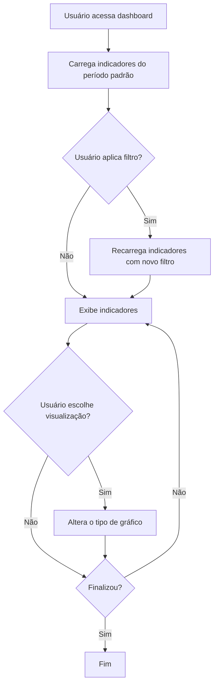
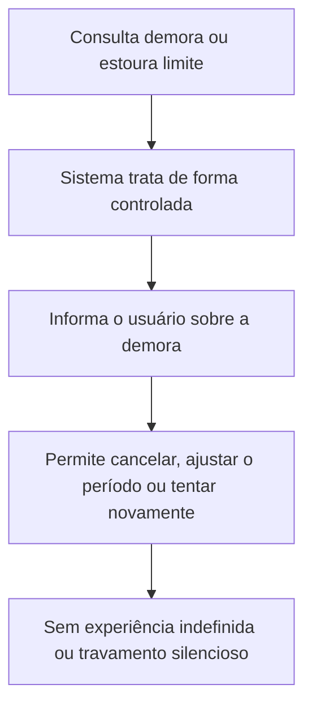
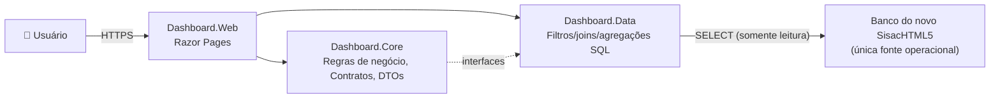

# PRD: Dashboard de Indicadores — Sisac Brasil

**Cliente/Produto:** Dashboard Sisac Brasil (módulo do novo SisacHTML5)
**Tipo:** Epic
**Autor:** Agente IA (leanwork-start)
**Data:** 2026-09-16
**Status:** Rascunho — revisão 2 (T-02 fechado documentalmente em 2026-09-17; revisão 1: gate de negócio aprovada em 2026-09-16)

> **Nota de revisão (gate de negócio 2026-09-16):**
> - **Fonte única de dados:** banco do novo SisacHTML5 (ADR-008). O legado VCL/Delphi é somente fonte de conhecimento, engenharia reversa e referência histórica — não é consultado em runtime e não é contrato de dados.
> - **Escopo conceitual:** 7 indicadores (Atendimentos, Consultas, Exames, Faturamento, Produção Médica, Despesas, Repasses).
> - **MPV implementável:** 6 indicadores. **Repasses** permanece no escopo conceitual/roadmap e é **bloqueado para implementação no MVP** (regra depende das particularidades de cada serviço de saúde).
> - **Reclassificados para backlog (fora do MVP):** Internações, Cirurgias, Ocupação, Glosas, Convênios como indicador independente, Unidade como dimensão/filtro.
> - **Histórico:** o histórico de 2025 e anos anteriores existente no banco novo será usado para homologação e demonstração.
> - RNs e CAs anteriores relativos a Ocupação/Glosas/Convênios foram **arquivados** (ver Apêndice B) — preservando rastreabilidade.

> **Nota de revisão (revisão 2 — fechamento documental T-02, 2026-09-17):**
> - **Premissa de banco:** o banco SQL padrão instalado para o SisacHTML5 é **essencialmente o mesmo banco utilizado pelo SghProg** (poucas mudanças/exclusões de colunas; estrutura, tabelas e organização no padrão do SghProg). O SghProg permanece **fonte estrutural válida de engenharia reversa**; estruturas conhecidas **não são descartadas automaticamente**; as diferenças vs. o SisacHTML5 serão confirmadas no T-03 e tratadas como **evidência de evolução do modelo**. Continua **vedado copiar regras de negócio do SghProg** (ADR-007/ADR-008).
> - **Decisões T-02 incorporadas:** **Produção Médica** — medida do quanto o profissional produziu no período, comparável entre profissionais, não presumida como apenas consultas (unidade técnica no T-03); **Conta a faturar** — contas de pacientes de convênio com alta e faturamento incompleto, com fluxo conceitual Atendimento→Alta→Processo→Envio/auditoria→Faturamento completo (representação física no T-03); **Despesas** — composição de fixas/variáveis registrada, com repasse médico classificado conforme a natureza contratual (representação física no T-03); **Consulta × Retorno** — conceitos distintos, retorno associado à consulta, agendado ou não, no prazo de até 30 dias da consulta (identificação técnica no T-03); **Período** — atual como período calendário corrente; futuros consultáveis; sem dados futuros = estado informativo, não previsão; **Cobertura SUS** — identificação técnica no T-03.

---

## 1. Visão geral

Dashboard web para visualização de indicadores operacionais de saúde do novo **SisacHTML5**, com dados consultados exclusivamente no banco do próprio SisacHTML5 (única fonte operacional — ADR-008). O sistema apresenta seis indicadores no MVP — Atendimentos, Consultas, Exames, Faturamento, Produção Médica e Despesas — com filtro por período (atual, passado e futuro), categorias de cobertura (Particular, Convênio, SUS) e visualização configurável (linhas, colunas, pizza). O objetivo do primeiro recorte é demonstrar, ao diretor de programação, a capacidade do novo SisacHTML5 de transformar dados operacionais em indicadores analíticos.

## 2. Problema e contexto

**Problema:** O novo SisacHTML5 passará a concentrar os dados operacionais do negócio. Sem uma interface analítica única, gestores seguem dependendo de relatórios manuais e ferramentas externas, com atraso na decisão e risco de dados desatualizados.

**Contexto atual:** O sistema legado VCL/Delphi será substituído. O Dashboard Sisac Brasil é um módulo do novo SisacHTML5 e consome exclusivamente o banco do próprio novo sistema. O sistema legado e seu banco não serão consultados pelo Dashboard (ADR-008).

**Impacto de não fazer:** A nova aplicação entrega dados operacionais sem a camada analítica necessária ao direcionamento do negócio, mantendo o time dependente de processos manuais.

## 3. Objetivo

Permitir que gestores e analistas visualizem indicadores operacionais de saúde em uma interface web única, com dados atualizados diretamente do banco do novo SisacHTML5, demonstrando a capacidade de transformar dados operacionais em indicadores analíticos.

### Métricas de sucesso

- Indicadores disponíveis em uma única tela sem necessidade de troca de sistema
- Tempo de carregamento inferior a 2 segundos por indicador para consultas regulares
- Dados sempre refletindo o estado atual do banco do novo SisacHTML5
- MVP validado contra histórico de 2025 e anteriores (homologação/demonstração)

## 4. Escopo

### 4.1. Dentro do escopo

- **MVP (6 indicadores implementáveis):** Atendimentos, Consultas, Exames, Faturamento, Produção Médica, Despesas
- **Escopo conceitual/roadmap (sem implementação no MVP):** Repasses — registrado, porém **bloqueado** (regra específica por serviço de saúde, a definir)
- Filtro por período: **atual**, **futuro** (com data inicial e final) e **passado** (com data inicial e final) — mecanismo uniforme
- Categorias de cobertura nos indicadores assistenciais e de Produção: **Particular, Convênio, SUS** (SUS somente quando o serviço atender SUS)
- Visualização configurável: linhas, colunas e pizza (quando semanticamente adequado)
- Consulta dinâmica ao banco do novo SisacHTML5 (sem persistência de indicadores)
- Interface responsiva com Razor Pages + Bootstrap 5 (a stack de apresentação será reavaliada no contexto do SisacHTML5 — ADR-002 revisada)
- Homologação/demonstração com dados históricos de 2025 e anteriores disponíveis no banco novo
- Tratamento controlado de consultas potencialmente lentas (requisito documentado)

### 4.2. Fora do escopo

- Acesso ao banco ou sistema legado em runtime (ADR-008)
- Repasses (MVP) — roadmap
- Ocupação, Glosas, Convênios como indicador independente, Internações, Cirurgias — backlog futuro
- Unidade como dimensão/filtro — **evolução futura** (depende da modelagem no SisacHTML5; não copiar a hierarquia `LOCAL` do legado)
- Alteração do schema do banco do SisacHTML5 / migração de dados de produção
- Persistência de indicadores (cache, snapshots, histórico)
- Exportação de relatórios (PDF, Excel)
- Autenticação e controle de acesso (fase futura)
- Integração com outros sistemas além do banco do novo SisacHTML5
- Indicadores além dos seis do MVP + Repasses (roadmap)

## 5. Personas e usuários impactados

| Persona | Papel | Como interage com a feature |
|---------|-------|----------------------------|
| Diretor de Programação | Patrocinador do MVP | Valida a demonstração da capacidade analítica do SisacHTML5 |
| Gestor Clínico | Responsável por unidades de atendimento | Acompanha indicadores assistenciais e da operação |
| Analista de Management | Profissional de análise de dados | Consulta indicadores consolidados para relatórios e insights |
| Diretor Operacional | Visão estratégica | Visualiza indicadores consolidados para tomada de decisão |

## 6. Hierarquia de entrega

- **Epic:** Dashboard de Indicadores de Saúde (Sisac Brasil)
  - **Feature:** Indicadores assistenciais
    - **PBI:** Atendimentos
    - **PBI:** Consultas
    - **PBI:** Exames
  - **Feature:** Indicadores financeiros e de produção
    - **PBI:** Faturamento (contas faturadas e a faturar)
    - **PBI:** Produção Médica
    - **PBI:** Despesas (fixas e variáveis)
  - **Feature:** Filtros e navegação
    - **PBI:** Filtro por período (atual, passado, futuro)
    - **PBI:** Categorias de cobertura (Particular, Convênio, SUS)
  - **Feature:** Layout e apresentação
    - **PBI:** Dashboard principal com grid de indicadores
    - **PBI:** Gráficos configuráveis (linhas, colunas, pizza)
    - **PBI:** Detalhamento de indicador (drill-down)
  - **Feature:** Roadmap (não-MVP)
    - **PBI:** Repasses (bloqueado até definição da regra de negócio)
    - **PBI:** Unidade como dimensão/filtro (evolução futura)

## 7. Fluxos

### 7.1. Fluxo principal



### 7.2. Fluxos alternativos / de erro

**Erro de conexão com banco:**
```mermaid
flowchart TD
    A[Tentativa de consulta ao banco do SisacHTML5] --> B[Falha de conexão]
    B --> C[Exibe mensagem "Dados indisponíveis no momento"]
    C --> D[Oferece opção de retry]
```

**Sem dados para o período/cobertura selecionado:**
```mermaid
flowchart TD
    A[Consulta retorna resultado vazio] --> B[Exibe "Nenhum dado encontrado para o período/cobertura selecionado"]
    B --> C[Sugere alterar filtros]
```

**Consulta potencialmente lenta / inviável (períodos históricos pesados);**


## 8. Regras de negócio

### Regras gerais

- **RN-01:** Todos os indicadores são calculados por consulta direta ao **banco do novo SisacHTML5** (única fonte operacional — ADR-008), sem persistência intermediária (ADR-004).
- **RN-02:** O acesso ao banco é exclusivamente **leitura** (ADR-003 — alvo revisado para o banco novo); nenhuma operação de escrita é permitida.
- **RN-03:** Indicadores sem dados para o período/cobertura selecionado exibem "Nenhum dado encontrado" em vez de valor zero ou vazio.
- **RN-04:** O período padrão de exibição é o mês corrente. O usuário pode selecionar: **período atual**; **período passado** com data inicial e data final; **período futuro** com data inicial e data final. O período **atual** pode ter como referência o **período calendário corrente**; **períodos futuros são consultáveis**; quando não houver dados (inclusive futuros), o sistema apresenta **estado informativo/sem dados** (RN-03) — a ausência de dados futuros **não é transformada em previsão** (decidido em T-02 — 2026-09-17).
- **RN-05:** Valores monetários são exibidos em R$ (Real brasileiro) com separador de milhar e duas casas decimais.
- **RN-06:** Percentuais são exibidos com uma casa decimal.

### Indicador — Atendimentos

- **RN-07:** O indicador de Atendimentos mostra a quantidade total de atendimentos realizados no período selecionado.
- **RN-08:** Atendimentos podem ser analisados por tipo de atendimento e por categoria de cobertura (RN-26). *Filtro de unidade é evolução futura (RN-45).*
- **RN-09:** O período de referência dos Atendimentos é a data do atendimento (data de atendimento, não data de lançamento).

### Indicador — Consultas

- **RN-28:** O indicador de Consultas mostra a quantidade de consultas realizadas no período selecionado. **Consulta** é o atendimento realizado pelo profissional de saúde a um paciente. **Retorno** é a consulta associada a uma consulta anterior, podendo ter sido previamente agendada ou não, desde que ocorra dentro do prazo de **até 30 dias** contados da data da consulta. Consulta e Retorno são **conceitos distintos** para o negócio; a forma técnica de identificá-los no banco do SisacHTML5 será confirmada no T-03 (não se assume código específico) (decidido em T-02 — 2026-09-17).
- **RN-30:** A relação entre Atendimento, Consulta e Exame será definida pelo **modelo de dados do novo SisacHTML5** (categorias de atendimento e/ou itens) e validada antes da implementação — **não** se presume hierarquia ou filiação.

### Indicador — Exames

- **RN-29:** O indicador de Exames mostra a quantidade de exames realizados no período selecionado, por tipo/grupo quando aplicável.
- **RN-30:** aplicável (ver Consultas).

### Indicador — Faturamento

- **RN-10:** O indicador de Faturamento mostra o valor faturado no período selecionado.
- **RN-11:** O Faturamento pode ser analisado por convênio cadastrado no novo SisacHTML5.
- **RN-12:** O valor é calculado a partir dos registros de faturamento (guia/conta de atendimento, não recebimento).
- **RN-13:** O período de referência é a data de emissão da guia/conta.
- **RN-31:** O Dashboard deve distinguir **contas faturadas** e **contas a faturar**. **Conta a faturar** corresponde a contas de pacientes atendidos por Convênio que receberam **alta** e que ainda **não foram completamente faturadas**; dependendo da data e do processo de envio das contas faturadas para auditoria e pagamento do Convênio, essas contas podem permanecer arquivadas em movimento próprio até o faturamento completo (decidido em T-02 — 2026-09-17).
- **RN-32:** O Faturamento deve permitir análise comparativa entre **período anterior** e **período atual**.
- **RN-33:** Os estados específicos do novo banco, a definição definitiva de "emissão" e a fórmula de "contas a faturar" serão definidos a partir do modelo do novo SisacHTML5 (regras em Core). O legado fornece evidências históricas, mas **não constitui contrato** para o novo banco. **Fluxo conceitual registrado (T-02):** Atendimento por Convênio → Alta do paciente → Conta em processo de faturamento → Envio/auditoria → Faturamento completo. Estados ou códigos do SghProg **não são reutilizados automaticamente** como contrato; no T-03 será identificado como o banco padrão do SisacHTML5 representa esse processo.

### Indicador — Produção Médica

- **RN-14:** O indicador de Produção Médica mostra a produtividade da produção dos profissionais de saúde no período selecionado.
- **RN-16:** **Produtividade médica** é a medida do quanto o profissional de saúde produziu dentro de determinado período, permitindo **comparar profissionais**. A produção **não** é presumida como apenas quantidade de consultas — consultas, exames solicitados e outras produções efetivamente registradas podem compor a produtividade. A definição técnica de quais registros constituem a **unidade de produção** será confirmada no contrato de dados (T-03), observando o modelo efetivamente disponível no SisacHTML5; **não se inventa fórmula matemática** (decidido em T-02 — 2026-09-17).
- **RN-34:** A Produção Médica deve considerar a produtividade por **profissional ativo**.
- **RN-35:** A Produção Médica deve permitir análise **individual/profissional** segundo a categoria de cobertura: Particular, Convênio, SUS (RN-26).
- **RN-36:** A Produção Médica deve permitir análise por **categoria do serviço de saúde**: Particular, Convênio, SUS (RN-26).
- **RN-15:** A Produção Médica pode ser analisada por categoria de cobertura (RN-26). *Filtro por especialidade e por unidade serão formalizados (especialidade: fonte a definir).*

### Indicador — Despesas

- **RN-37:** O indicador de Despesas mostra as **despesas fixas** do período selecionado. Composição registrada (T-02): **energia, água, aluguel, condomínio, salários** e **repasses médicos com datas de vencimento previstas em contrato**.
- **RN-38:** O indicador de Despesas mostra as **despesas variáveis** do período selecionado. Composição registrada (T-02): **compras de equipamentos, móveis, utensílios necessários para determinado local de atendimento** e **repasse médico conforme contrato**.
- **RN-39:** A visualização deve permitir **comparação gráfica** entre despesas fixas e variáveis.
- **Nota (T-02):** o **repasse médico pode aparecer como despesa fixa ou variável dependendo da natureza contratual** — **não** se classifica automaticamente toda despesa de repasse médico em uma única categoria; a representação dessa classificação no banco do SisacHTML5 será investigada no T-03 (decidido em T-02 — 2026-09-17).

### Indicador — Repasses (roadmap — bloqueado no MVP)

- **RN-40:** Repasses é indicador do **escopo conceitual/roadmap** e está **bloqueado para implementação no MVP**. A regra depende das particularidades de cada serviço de saúde e será criada posteriormente como regra de negócio explícita (em Core). Não se assume: relação Faturamento → Repasses; Repasse = percentual do faturamento; Repasse = honorários médicos; nem qualquer fórmula presente no legado.

### Regras transversais

- **RN-26:** Os indicadores assistenciais (Atendimentos, Consultas, Exames) e a Produção Médica devem permitir análise pela **categoria/cobertura**:
  - **Particular**
  - **Convênio** (efetivamente cadastrado no novo SisacHTML5)
  - **SUS**, somente quando o serviço de saúde atender SUS
  - Não se assume códigos, nomes ou estruturas do banco legado como contrato.
- **RN-27:** Os indicadores devem permitir diferentes formas de **visualização** — linhas, colunas e pizza — quando semanticamente adequadas ao conjunto de dados. A escolha do gráfico **não** é regra de negócio; é responsabilidade da apresentação (Dashboard.Web).
- **RN-41:** **Faturamento, Despesas e Repasses são medidas conceitualmente independentes.** Não criar automaticamente Resultado = Faturamento − Despesas, Margem = Faturamento − Despesas − Repasses ou qualquer derivada. Indicadores financeiros derivados são decisões futuras de negócio, cada um com sua regra em Core.
- **RN-42:** O mecanismo de filtro por período é **uniforme** para os indicadores. Cada indicador possui sua **data de referência de negócio** própria, definida em Core.
- **RN-43:** Consultas históricas potencialmente **pesadas ou inviáveis** devem ser tratadas de forma **controlada**, informando o usuário e permitindo cancelamento/ajuste/tentativa, sem experiência indefinida ou travamento silencioso. (Implementação não faz parte dos documentos de regra; é requisito de produto documentado.)
- **RN-44:** O histórico de **2025 e anos anteriores** presente no banco novo será utilizado para **homologação e demonstração** dos indicadores. O filtro por período é o mecanismo central de operação e de validação dos dados históricos.
- **RN-45:** **Unidade** como dimensão/filtro **não faz parte do MVP** — é evolução futura, condicionada à modelagem efetiva no novo SisacHTML5. Não se copia a hierarquia `LOCAL` do legado.

## 9. Critérios de aceite

```gherkin
Funcionalidade: Dashboard de Indicadores de Saúde — MVP

  Cenário [CA-01]: Dashboard carrega indicadores do período padrão
    Dado que o usuário acessa a página principal do dashboard
    Quando a página é carregada
    Então os seis indicadores do MVP são exibidos com dados do mês corrente (RN-04)
    E cada indicador exibe seu valor, unidade de medida e período de referência

  Cenário [CA-02]: Usuário filtra indicadores por período
    Dado que o dashboard está exibindo indicadores do mês corrente
    Quando o usuário seleciona um período passado (data inicial/final) ou futuro (data inicial/final)
    Então todos os indicadores são recarregados conforme o período (RN-04, RN-42)
    E os valores refletem exclusivamente o período selecionado

  Cenário [CA-03]: Indicador de Atendimentos exibe quantidade correta
    Dado que existem 150 atendimentos registrados em março/2026
    Quando o usuário seleciona período "Março/2026"
    Então o indicador de Atendimentos exibe "150" (RN-07)

  Cenário [CA-04]: Indicador de Faturamento exibe valor monetário formatado
    Dado que o faturamento total de março/2026 é R$ 450.000,00 (contas faturadas)
    Quando o indicador de Faturamento é exibido
    Então o valor é mostrado como "R$ 450.000,00" (RN-05, RN-10, RN-31)

  Cenário [CA-05]: Indicador de Produção Médica calcula segundo a métrica definida
    Dado que em março/2026 houve 300 atendimentos e 10 profissionais ativos
    Quando o indicador de Produção Médica é calculado
    Então o valor exibido respeita a métrica formalizada (RN-14, RN-16, RN-34)

  Cenário [CA-09]: Sem dados para período/cobertura selecionado
    Dado que não há dados para o período/cobertura selecionada
    Quando o usuário seleciona esse período/cobertura
    Então o indicador exibe "Nenhum dado encontrado" (RN-03)
    E os demais indicadores sem dados também exibem a mensagem correspondente

  Cenário [CA-10]: Erro de conexão com banco de dados
    Dado que a conexão com o banco do SisacHTML5 está indisponível
    Quando o usuário acessa o dashboard
    Então uma mensagem "Dados indisponíveis no momento" é exibida
    E uma opção de retry está disponível

  Cenário [CA-11]: Indicador de Consultas exibe quantidade correta
    Dado que há 80 consultas registradas em março/2026 (primeiras consultas e/ou retornos conforme definição)
    Quando o indicador de Consultas é exibido
    Então a quantidade de consultas do período é exibida (RN-28)

  Cenário [CA-12]: Indicador de Exames exibe quantidade correta
    Dado que há 120 exames registrados em março/2026
    Quando o indicador de Exames é exibido
    Então a quantidade de exames do período é exibida (RN-29)

  Cenário [CA-13]: Despesas comparam fixas e variáveis
    Dado que em março/2026 as despesas fixas somam R$ 200.000,00 e as variáveis R$ 80.000,00
    Quando o indicador de Despesas é exibido
    Então fixas e variáveis são apresentadas e comparáveis graficamente (RN-37, RN-38, RN-39)

  Cenário [CA-14]: Faturamento distingue faturadas e a faturar e compara períodos
    Dado que em março/2026 existem R$ 450.000,00 faturados e R$ 30.000,00 a faturar
    Quando o indicador de Faturamento é exibido
    Então "contas faturadas" e "contas a faturar" são distinguidas (RN-31)
    E é possível comparar com o período anterior (RN-32)

  Cenário [CA-15]: Seleção de período futuro e passado
    Dado que o mecanismo de filtro é uniforme
    Quando o usuário define um período passado ou futuro com data inicial e data final
    Então todos os indicadores atendidos respeitam o novo período (RN-04, RN-42)

  Cenário [CA-16]: Visualização configurável
    Dado que um indicador tem dados no período
    Quando o usuário altera a forma de visualização (linhas, colunas, pizza)
    Então o gráfico é reexibido na forma escolhida, quando semanticamente adequada (RN-27)

  Cenário [CA-17]: Consulta potencialmente lenta é tratada de forma controlada
    Dado que uma consulta histórica está demorando ou é inviável
    Quando a consulta excede o limite controlado
    Então o usuário é informado sobre a demora e pode cancelar/ajustar/tentar novamente (RN-43)

  Cenário [CA-18]: Categorias de cobertura
    Dado que o serviço atende Particular, Convênio e SUS
    Quando um indicador assistencial ou de Produção é filtrado por categoria de cobertura
    Então os valores são apresentados por categoria (RN-26)
    E SUS só é considerado quando o serviço atender SUS

  Cenário [CA-19]: Repasses não é implementado no MVP
    Dado que Repasses está no escopo conceitual/roadmap
    Quando o dashboard do MVP é exibido
    Então nenhum cálculo/representação de Repasses é implementado (RN-40)

  Cenário [CA-20]: Histórico de homologação disponível
    Dado que o banco novo contém dados de 2025 e anteriores
    Quando períodos históricos são selecionados para homologação
    Então os indicadores calculam sobre esses dados e são validados conceitualmente (RN-44)
```

## 10. Permissionamento

> **Premissa:** Controle de acesso não definido no escopo atual. Todos os usuários autenticados (quando houver autenticação) terão acesso a todos os indicadores. Restrição por unidade pode ser considerada em fase futura (RN-45).

| Ação | Perfis autorizados | Observação |
|------|-------------------|------------|
| Visualizar indicadores | Todos os usuários | Sem restrição por perfil no estágio atual |
| Filtrar por período e cobertura | Todos os usuários | Sem restrição por perfil no estágio atual |

## 11. Integrações e dados

### 11.1. Sistemas envolvidos

- **Banco do novo SisacHTML5** — única fonte operacional, via consulta direta (somente leitura — ADR-003 revisada/ADR-008).
- **Sistema legado VCL/Delphi** — **não** é fonte em runtime; apenas conhecimento de engenharia reversa (ADR-008).

### 11.2. Dados consumidos (conceitual — schema definitivo em T-03)

| Indicador | Dados necessários (conceito) | Nota |
|-----------|------------------------------|------|
| Atendimentos | Movimentação assistencial (data, tipo, estado, cobertura, convênio/plano, profissional) | Nomes físicos definidos no contrato de dados |
| Consultas | Registro de consulta (data, tipo/retorno, profissional, cobertura, estado) | Relação com Atendimento a definir (RN-30) |
| Exames | Registro de exame (data, tipo/grupo, profissional, cobertura, estado) | Relação com Atendimento a definir (RN-30) |
| Faturamento | Guia/Conta (estado, data de emissão, convênio, unidade, valor) e itens (valor, quantidade, categoria) | Contas faturadas e a faturar (RN-31..33) |
| Produção Médica | Atendimentos/produção vinculados a profissional ativo; categorias de cobertura | Métrica/papel/ativo a formalizar |
| Despesas | Despesas (grupo fixa/variável, categoria, data/referência, valor) | Grupos/categorias/origem a formalizar |
| Repasses (roadmap) | — | Bloqueado; regra a definir (RN-40) |

### 11.3. Dados produzidos / persistidos

Nenhum. Todos os indicadores são calculados por consulta dinâmica e não são persistidos (ADR-004).

### 11.4. Eventos

Nenhum. O dashboard é de consulta apenas, sem publicação ou consumo de eventos.

## 12. Diagrama de estados

Não aplicável. Os indicadores são valores calculados, não entidades com ciclo de vida.

## 13. Arquitetura técnica



Referência: `docs/architecture/proposta-arquitetural.md` (ADR-001, ADR-003 revisada, ADR-004 revisada, ADR-005, ADR-007) e `docs/architecture/adrs/ADR-008-banco-sisac-html5-fonte-unica-operacional.md`.

## 14. Restrições e premissas

- **Restrição:** Acesso ao banco é exclusivamente leitura (ADR-003 revisada), sobre o banco do novo SisacHTML5.
- **Restrição:** O banco do novo SisacHTML5 é a única fonte operacional; o legado não é consultado em runtime (ADR-008).
- **Restrição:** Sem persistência de indicadores — consultas dinâmicas (ADR-004).
- **Restrição:** Sem Application Layer, CQRS, Mediator ou camadas adicionais; sem migrations do dashboard (ADR-001).
- **Premissa:** O histórico de 2025 e anteriores já estará disponível no banco novo para homologação/demonstração.
- **Premissa:** A modelagem do novo banco (domínios, estados, categorias) será definida pelo SisacHTML5 e validada antes da implementação (T-03 e T-02 do PLAN-001).
- **Premissa (T-02):** o banco SQL padrão instalado para o SisacHTML5 é **essencialmente o mesmo banco utilizado pelo SghProg** (pequenas mudanças/exclusões de colunas; estrutura geral no padrão do SghProg). Sob essa premissa, o SghProg permanece **fonte estrutural válida de engenharia reversa** e **não se descartam automaticamente** tabelas/campos/estruturas conhecidas; as diferenças vs. o banco do SisacHTML5 serão confirmadas no **T-03** e tratadas como **evidência de evolução do modelo**. **Regras de negócio não são copiadas do SghProg** (ADR-007 / ADR-008).
- **Premissa:** "Unidade" não é filtro do MVP (RN-45). "Repasses" não é implementado no MVP (RN-40).

## 15. Riscos e dependências

| Tipo | Descrição | Mitigação / Plano |
|------|-----------|-------------------|
| Risco | Schema do banco novo ainda em definição | Contrato de dados (T-03) validado antes das queries (Fase 3) |
| Risco | Consultas históricas pesadas (2025+) | Tratamento controlado de lentidão (RN-43); otimização SQL na camada Data |
| Risco | Definições de negócio pendentes (faturamento, produção, despesas) | Alinhamento com stakeholders e produto (T-02) antes de implementar |
| Risco | Paridade histórica com relatórios do legado não garantida | Homologação conceitual com dados de 2025+ (RN-44); não é contrato |
| Dependência | Modelo de dados do novo SisacHTML5 | Sessões de definição no contrato de dados (T-03) e na validação do produto |

## 16. Questões em aberto (MVP)

> **Nota (revisão 2 — fechamento documental T-02, 2026-09-17):** as questões Q2–Q6 e Q10 tiveram a **decisão de negócio registrada** neste documento (Capítulos 8–12, Nota de revisão e RNs). Permanece em aberto apenas a **identificação técnica** correspondente, a responder no **T-03** a partir do banco padrão do SisacHTML5 (comparado ao SghProg).

> **Nota (fechamento técnico T-08 — 2026-09-18, sessão de decisão sobre o ambiente CASAMATER):** a identificação técnica de **Atendimentos** foi investigada e decidida: fonte canônica `dbo.ENTRADA` (data `DATAHORAENT` — RN-09; contagem `Fechado <> 'C' AND LoteEnt <> 'INAT'` — RN-07); tipo por `ENTRADA.TIPO` (mapeamento 1–6 confirmado; `7`/`P`/`U`/`''`/`NULL` → "Não classificado" — RN-08/Q2); cobertura por `CADCONVENIO.MODOFAT` (`C`→Convênio, `P`→Particular, `S`→SUS, vazio/NULL→"Não classificado" — RN-26/Q10). Evidências registradas em `dicionario-de-dados.md` (§13.2) e `contrato-dados-dashboard.md` (§7). A identificação permanece válida para o ambiente legado investigado; a homologação no novo SisacHTML5 (T-03) pode revisá-la.

- [ ] Q1: Qual o contrato de dados (entidades/atributos mínimos) que o banco do novo SisacHTML5 deve expor para os seis indicadores? — *responsável: produto + modelo do SisacHTML5 (T-03)*
- [ ] Q2 (negócio decidida em T-02): Como o novo banco modela Atendimento, Consulta e Exame (categorias de uma movimentação vs itens)? Consulta e Retorno são conceitos distintos; retorno associado à consulta, agendado ou não, dentro de até 30 dias (RN-28). Entidades físicas de Consulta, Retorno e Exame e a identificação dos tipos assistenciais — *identificação técnica: T-03*
- [ ] Q3 (negócio decidida em T-02): Definição exata de produtividade, de "profissional ativo", papel considerado e métrica da Produção Médica; fonte da especialidade (quando necessária). Produtividade = produção do profissional no período, comparável entre profissionais, não presumida como apenas consultas (RN-16). Unidade de produção médica, identificação de profissional ativo e papéis profissionais — *identificação técnica: T-03*
- [ ] Q4 (negócio decidida em T-02): Estados de faturamento no novo banco ("faturada"/"a faturar"), definição de "emissão" e fórmula de contas a faturar. Conta a faturar = contas de convênio com alta e faturamento incompleto; fluxo Atendimento → Alta → Conta em processo → Envio/auditoria → Faturamento completo (RN-31/RN-33). Estados de conta, campo/evento de emissão/envio e estrutura de movimentos de faturamento — *identificação técnica: T-03*
- [ ] Q5 (negócio decidida em T-02): Composição das Despesas: grupos fixa/variável, categorias, data de referência (competência vs pagamento) e origem no novo banco. Composição registrada em RN-37/RN-38; repasse médico conforme natureza contratual (Nota T-02 em Despesas). Origem, classificação e data de referência das despesas — *identificação técnica: T-03*
- [ ] Q6 (negócio decidida em T-02): Granularidade e regras do filtro por período (meses/dias), e comportamento com períodos futuros. Atual = período calendário corrente; futuros consultáveis; ausência de dados futuros = estado informativo, não previsão (RN-04). Calibração das consultas de período (validar desempenho de períodos grandes) — *identificação técnica: T-03*
- [ ] Q7: Repasses — regra e modelo, quando o produto demandar — *roadmap (sem tarefa no MVP)*
- [ ] Q8: Unidade como dimensão/filtro — *evolução futura (RN-45)*
- [ ] Q9: Autenticação/autorização — *fora do escopo atual*
- [ ] Q10 (negócio decidida em T-02): Como será identificada a cobertura SUS no novo modelo (somente quando o serviço atender SUS)? Identificação técnica de Particular/Convênio/SUS e do atendimento SUS via cadastro/configuração do serviço — *identificação técnica: T-03*

## 17. Referências

- Proposta arquitetural: `docs/architecture/proposta-arquitetural.md`
- ADR-001: Arquitetura em três camadas
- ADR-003: Acesso ao banco em modo exclusivo leitura (revisada — alvo: banco novo)
- ADR-004: Não persistir indicadores — consultas dinâmicas (contexto revisado)
- ADR-006: Sistema legado como referência (supersedida parcialmente por ADR-008)
- ADR-007: Regras de negócio em Core
- ADR-008: Banco do novo SisacHTML5 como única fonte operacional
- Dicionário de dados: `docs/architecture/dicionario-de-dados.md` (conhecimento do legado + domínios conceituais)

---

## Apêndice A — Histórico de revisão

| Data | Versão | Autor | Descrição |
|------|--------|-------|-----------|
| 2026-09-16 | 0.1 | Agente IA | Versão original (escopo com 6 indicadores do legado) |
| 2026-09-16 | 1.0 | Agente IA + gate humana | **Gate de negócio aprovada**: fonte única = banco do novo SisacHTML5 (ADR-008); MVP com 6 indicadores implementáveis (Atendimentos, Consultas, Exames, Faturamento, Produção Médica, Despesas); Repasses em roadmap; Unidade futura; coberturas Particular/Convênio/SUS; gráficos configuráveis; períodos atual/passado/futuro; tratamento de consultas lentas; homologação com histórico 2025+ |
| 2026-09-17 | 2.0 | Agente IA + gate humana | **Fechamento documental T-02**: decisões de negócio registradas (Produtividade Médica — RN-16; Conta a faturar e fluxo — RN-31/RN-33; composição de Despesas — RN-37/RN-38 e nota de repasse médico; Consulta × Retorno ≤ 30 dias — RN-28; Período atual/futuro — RN-04); **premissa de banco** registrada (SisacHTML5 ≈ SghProg — ADR-008); questões Q2–Q6 e Q10 marcadas como "negócio decidida"; **identificação técnica remetida ao T-03** |
| 2026-09-18 | 2.1 | Agente IA + gate humana | **Fechamento técnico T-08** (ambiente CASAMATER): fonte canônica `ENTRADA` + `CADCONVENIO.MODOFAT` (RN-07/08/09/26); contagem `Fechado <> 'C' AND LoteEnt <> 'INAT'`; tipo por `TIPO` (mapeamento 1–6, resto → "Não classificado"); cobertura por `MODOFAT` (C/P/S, vazio→"Não classificado"); P15/P18 e Q2/Q10 pendências técnicas resolvidas — ver Nota em §16 |

## Apêndice B — RNs e CAs arquivados (backlog — fora do MVP)

Registros da versão 0.1 que foram **reclassificados** para backlog futuro, preservando a rastreabilidade. Não são parte do MVP.

| Regra | Conteúdo arquivado |
|-------|--------------------|
| RN-17 | Taxa de ocupação de leitos (indicador Ocupação) |
| RN-18 | Ocupação filtrada por unidade e tipo de leito |
| RN-19 | Fórmula (Leitos ocupados ÷ Leitos disponíveis) × 100 |
| RN-20 | Valor total de glosas aplicadas pelos convênios |
| RN-21 | Glosas filtradas por unidade e convênio |
| RN-22 | Período de referência = data de notificação da glosa |
| RN-23 | Distribuição de atendimentos por convênio |
| RN-24 | Convênios filtrados por unidade |
| RN-25 | Apresentação em tabela/gráfico por convênio |

CAs arquivados: **CA-06** (Ocupação), **CA-07** (Glosas), **CA-08** (Convênios) — referentes às RNs acima. Retornam ao PRD quando os indicadores forem formalmente solicitados com suas regras no novo modelo.