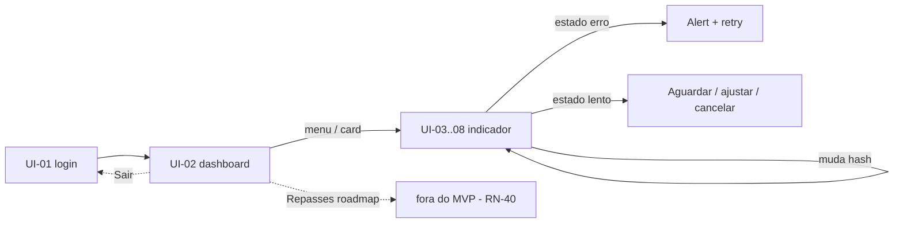

# SPEC-UI-001 — Dashboard de Indicadores (Sisac Brasil)

> Protótipo visual · Leanwork SDD · Modo B (Geração)
> Mapeia: `docs/prds/PRD-001-dashboard-indicadores.md`
> Status: **aguardando validação humana**

## 1. Contexto e propósito

Protótipo navegável (wireframe funcional) do Dashboard Sisac Brasil, permitindo validar com o
stakeholder a arquitetura de interface do MVP antes da implementação em ASP.NET Core Razor Pages.

Fluxo demonstrado:

```
Login (simulado) → Dashboard (visão geral) → Indicador → Filtros → Gráfico → Linha/Coluna/Pizza
```

Todas as 6 telas de indicador do MVP (UI-03..UI-08) são cobertas pela mesma página parametrizada
por fragmento (`#atendimentos`, `#consultas`, `#exames`, `#faturamento`, `#producao`, `#despesas`),
refletindo o mecanismo uniforme de filtros (RN-42) e o framework comum de gráficos (RN-27/RN-32).

## 2. Objetivos de UX

| # | Objetivo |
|---|----------|
| UX-01 | Gestor obtém resposta visual em menos de 5s para a pergunta "como está meu serviço neste período" |
| UX-02 | Um mesmo mecanismo de filtros (período, cobertura, contagem) vale para todos os indicadores |
| UX-03 | Coberturas ambíguas (RN-26), contagens (RN-27) e grupos de exame (RN-29/30) visíveis e explicados |
| UX-04 | Estados de resposta transparentes: carregando, vazio, erro e lento (CA-09/10/16/17) |
| UX-05 | Escolha de apresentação do gráfico (linha, coluna, pizza) sempre disponível (RN-27) |
| UX-06 | Dados fictícios e definições em aberto sempre rotulados como tal (sem presumir regra) |

## 3. Restrições e decisões de escopo

| Restrição | Tratamento no protótipo |
|-----------|--------------------------|
| Sem código de produção (Razor Pages/Core/Data) | Apenas HTML estático + Bootstrap 5 (CDN 5.3.3) + JS vanilla em `assets/` |
| Sem acesso a banco do SisacHTML5 (T-03 não executado) | Dados 100% fictícios e rotulados |
| Autenticação fora de escopo (Q9) | Tela de Login **simulada** (adição de escopo solicitada pelo stakeholder) |
| Repasses fora do MVP (RN-40) | Presente apenas como item *roadmap* no menu e nota de rodapé |
| Indicadores fora do MVP (RN-45: Ocupação, Glosas, Convênios, Cirurgias, Internações) | Nada além de menção em nota |
| Fidelidade | **Wireframe** funcional (sem skill de frontend; sem visual definitivo) |
| Identidade visual | Proposta "Corporativa sóbria" (abaixo) — **pendente validação do stakeholder** |

## 4. Design tokens (proposta a validar)

| Token | Valor | Uso |
|-------|-------|-----|
| `--brand` | `#0d4d8c` (azul corporativo) | Marca Sisac, links, botões primários |
| `--brand-dark` | `#0a3d6e` | Hover de botões primários |
| `--brand-soft` | `#eef4fb` | Fundos secundários / áreas destacadas |
| `--fundo` | `#f4f6f9` | Fundo da página |
| Cores de série | `#0d4d8c` / `#1b7eb4` / `#7bae3f` | Séries/coberturas (Particular/Convênio/SUS) |
| Destaque monetário | `#e8a33d` | "A faturar", "Variáveis" |
| Acesso | `<2rem` (`.82rem`) | Notas "fictício/ref", tipografia secundária |
| Tipografia | System stack (Bootstrap default) + font-weight 700 para números-chave | Legibilidade |

> Decisão em aberto: **paleta de cores e densidade** devem ser validadas com branding oficial.

## 5. Inventário de telas (UI)

| UI | Tela | Rota/arquivo protótipo | Entregável em produção |
|----|------|------------------------|------------------------|
| UI-01 | Login (simulado) | `assets/login.html` | Tela de autenticação (fora do MVP — Q9) |
| UI-02 | Dashboard — visão geral dos 6 indicadores | `assets/dashboard.html` | `Index` |
| UI-03 | Detalhe de **Atendimentos** | `assets/indicador.html#atendimentos` | `Indicador.cshtml?tipo=atendimentos` |
| UI-04 | Detalhe de **Consultas** | `assets/indicador.html#consultas` | `Indicador.cshtml?tipo=consultas` |
| UI-05 | Detalhe de **Exames** | `assets/indicador.html#exames` | `Indicador.cshtml?tipo=exames` |
| UI-06 | Detalhe de **Faturamento** | `assets/indicador.html#faturamento` | `Indicador.cshtml?tipo=faturamento` |
| UI-07 | Detalhe de **Produção Médica** | `assets/indicador.html#producao` | `Indicador.cshtml?tipo=producao` |
| UI-08 | Detalhe de **Despesas** | `assets/indicador.html#despesas` | `Indicador.cshtml?tipo=despesas` |

## 6. Estados por tela

Conforme catálogo do skill `prototype-leanwork`. Toggle "Demonstrar estado" fixo no canto inferior direito.

| Estado | Dashboard | Indicador | Comportamento simulado |
|--------|-----------|-----------|------------------------|
| `default` | Cards com valores fictícios | Indicador completo | Mostra dados; filtros reativos |
| `carregando` | Skeleton x6 | Skeleton | Placeholder shimmer |
| `vazio` | Cards "Nenhum dado" (RN-03/CA-09) | Card "Nenhum dado" + botão Limpar filtros | Nenhuma linha retornada para o recorte |
| `erro` | Alert (CA-10) + Tentar novamente | Alert + Tentar novamente | Falha/conexão (isolada por indicador) |
| `lento` | — | Alert (RN-43/CA-17) com Aguardar/Ajustar período/Cancelar | Consulta histórica demorando |

## 7. Componentes reutilizáveis

| Componente | Definição |
|------------|-----------|
| `NavbarBrand` | Marca + menu "Indicadores" (6 links + Repasses *roadmap*) |
| `CardIndicador` (UI-02) | Título, valor-chave, série por cobertura, referência RN, ação "Analisar" |
| `SeletorPeriodo` | Atual/Passado/Futuro + datas iniciais/finais (RN-42) |
| `SeletorCobertura` | Todas/Particular/Convênio/SUS (RN-26) |
| `SeletorContagem` | Individual/Acumulada (PRD §7) |
| `SeletorFatura` | Faturadas/A faturar (RN-31) — exibido só em Faturamento |
| `SeletorConvenio` | Dropdown fictício (RN-11) — só Faturamento |
| `SeletorDespesas` | Fixas/Variáveis/Todas (RN-37/38) — só Despesas |
| `SeletorProfissional` | Dropdown fictício — só Produção (RN-34/35) |
| `SeletorGrupoExame` | Dropdown conceitual (RN-29/30) — só Exames |
| `SeletorTipoGrafico` | Linha/Coluna/Pizza (RN-27) |
| `GraficoIndicador` | SVG gerado: linha (evolução), coluna (evolução), pizza (distribuição) |
| `ResumoIndicador` | Tabela por categoria + total; tabela por profissional (Produção) |
| `ComparativoPeriodo` | Faturamento: atual × anterior + variação (RN-32) |
| `BannerDadosIlustrativos` | Alerta global "dados fictícios / definição pendente" |

## 8. Fluxo de navegação



## 9. Mapeamento RN / CA

| Regra/Cenário | Onde aparece |
|---------------|--------------|
| RN-03 / CA-09 (período sem dados) | Estado `vazio` |
| RN-09 (atendimento: data do atendimento) | Ref. Atendimentos |
| RN-11 (convênio) | Filtro Convênio (faturamento) |
| RN-13 (faturamento: emissão da guia/conta) | Ref. Faturamento |
| RN-16, RN-34, RN-35 (produção/profissional) | Filtro Profissional + tabela (ilustrativa, T-02) |
| RN-26 (cobertura/SUS) | Filtro Cobertura com nota |
| RN-27 (tipos de gráfico) | Seletor Linha/Coluna/Pizza |
| RN-28 (1ª consulta × retorno) | Placeholder conceitual em Consultas |
| RN-29/30 (grupos de exame) | Filtro Grupo de Exame |
| RN-31 (contas faturadas/a faturar) | Filtro Fatura |
| RN-32 (comparativo com período anterior) | Card Comparativo (Faturamento) |
| RN-33 (estados de faturamento) | Note em Faturamento: a definir |
| RN-37/38 (fixas/variáveis) | Filtro Despesas |
| RN-40 (Repasses fora do MVP) | Menu *roadmap* + nota |
| RN-42 (mechanismo uniforme de período) | SeletorPeríodo presente em todos |
| RN-43 / CA-17 (performance histórico) | Estado `lento` |
| CA-10 (falha de conexão) | Estado `erro` |
| CA-18 (definição/exportação de gráficos) | Seletor de tipo de gráfico; exportação **não** no MVP |
| Q2 (tipo de atendimento), Q3 (produção), Q5 (despesas), Q9 (auth) | Placeholders/notas marcadas; T-02/T-03 |

## 10. Lacunas e decisões a validar (APÓS a rodada)

1. **Valores dos cards** (Atendimentos 1.714; Consultas 294; Exames 442; Faturamento R$ 470.000 + R$ 30.000 a faturar; Produção 1.714 / 38 prof. ativos; Despesas R$ 243.000) — meramente ilustrativos.
2. **Fidelidade wireframe**: aprovar para avançar a protótipo de alta (com skill de frontend) ou ajustar aqui.
3. **Identidade visual**: validar paleta "Corporativa sóbria" ou apontar diretriz de marca.
4. **Login**: manter como tela de abertura no protótipo, ou começar direto no Dashboard?
5. **Repasses**: confirmar exclusão da navegação ativa (RN-40) até novo PRD.
6. **Pizza ignora filtro de cobertura**: decisão de negócio se a distribuição deve respeitar o filtro ou representar ~o total do período~.

## 11. Fidelidade declarada

- **Artefato:** wireframe navegável (HTML + Bootstrap 5 CDN + JS vanilla).
- **Gráficos:** SVG gerados no cliente; sem biblioteca de chart (nº de séries pequeno).
- **Dados:** fictícios; **nenhum valor real**; sem acesso a banco.
- **Requisições:** nenhuma chamada de API; estados simulados por toggle.
- **Requer internet** para o CDN do Bootstrap (ou servir `assets/` estaticamente).